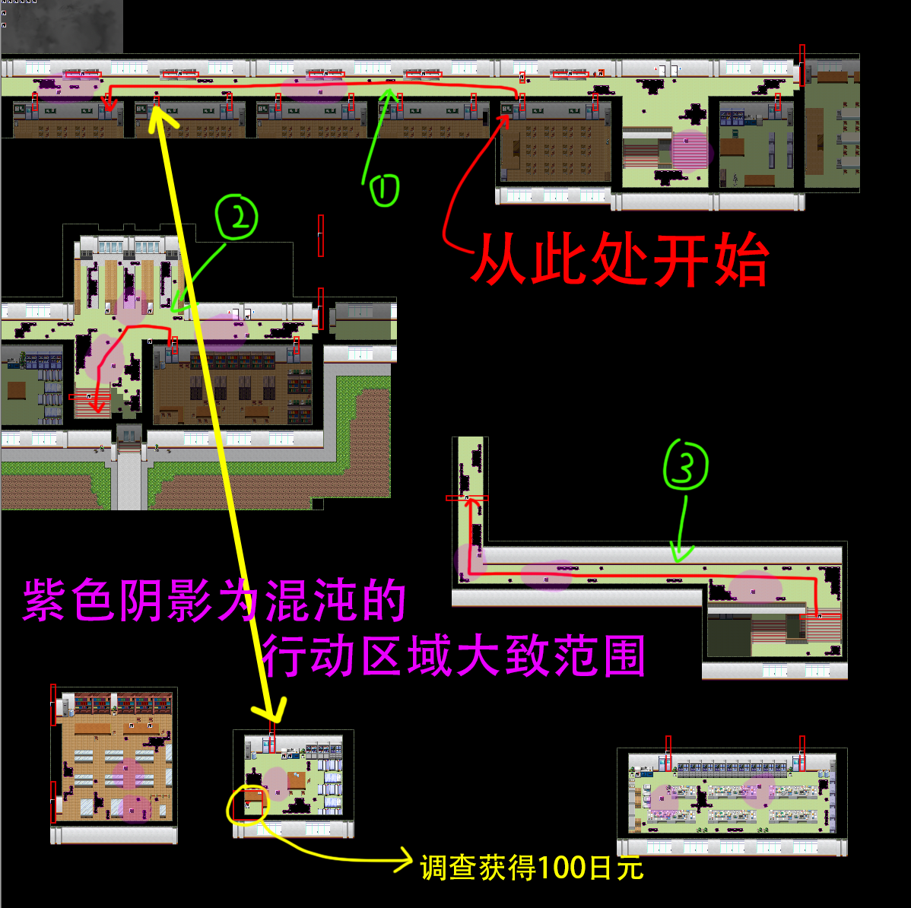

## 进入条件

开头剧情后强制进入。

## 分からないところ

存档教学，从这里开始才可以存档。向上一直走进入下一个场景。

## 木柚1

跟随路径前进，捡到**发卡。**

## 木柚2

教学：推拉物品

站在可移动物品旁边，面朝可移动物品按住Enter，再按方向键即可。可以将物品向前推或者向后拉。~~（你已经学会了移动物品，接下来开始[推箱子](05兔.md)吧！）~~

## ？？？1

调查秋穹旁边写有红字的墙壁，右边的石板会显示出谜题。进行解谜并在出口的混沌处输入答案。输入正确答案即可打开进入下一场景的门。（即使没有调查墙壁，输入正确答案依然算作过关）

首次输入错误答案会触发**场景5**，而再次输入错误答案则不会再次触发。

调查右侧的书架，可以阅读操作说明。

再次调查写有红字的墙壁选择“自己思考一下”可以继续答题，选择“拜托了”会由秋穹讲解答题方法，选择“帮我解答吧”秋穹则会直接给出答案。

（之后在大部分“？？？”场景内与秋穹对话都可以得到类似选项）

和豆豆对话后，再和秋穹对话，获得称号**萝莉控**。

## 木柚3

教学：后退

当背向时，某些墙壁会消失，按A后退即可通过。

## 木柚4

出口处选择道具：发卡（选择另外两个有对话）

## ？？？2

右下角捡到**手电筒**。

右下角调查红色书可以显示谜题。

讲台上调查蓝色书可以阅读操作说明。

与鸡对话，获得**运动服**。

如果你在“？？？1”中未触发**场景5**，那么在“？？？2”中输入错误答案也会触发**场景5**。

## 木柚5

按Q开启手电筒。

注意躲避混沌，被混沌碰到会立即死亡并返回关卡开始。

本章混沌移动速度较慢，可以选择在混沌移动一格后将其绕过。

走廊左起第二个教室的房间垃圾箱有100日元。

地图：

## 木柚6

直接前进

## ？？？

选项：

- 右手：通关
- 左手：通关（会遇到四季。最好不要选这个选项！遇到四季的次数小于3次时，[出教学楼]()时才会先触发一次BE剧情，否则无法看到此BE的剧情。如果这里遇到四季则一定无法看到出教学楼的BE。）
- 双手：触发**场景6**，回到“木柚6”地图末尾。

## 通关后

结束后回到5-2教室，获得**橡胶挂件001**。

与木柚对话并选择“进入内心”可以重新回到木柚章节。此时“木柚5”地图中的所有混沌会消失。

回到“？？？”可以看到三只混沌，与混沌对话并选择“碰一下”可观看在本章出现的场景。

[回到目录](README.md)
