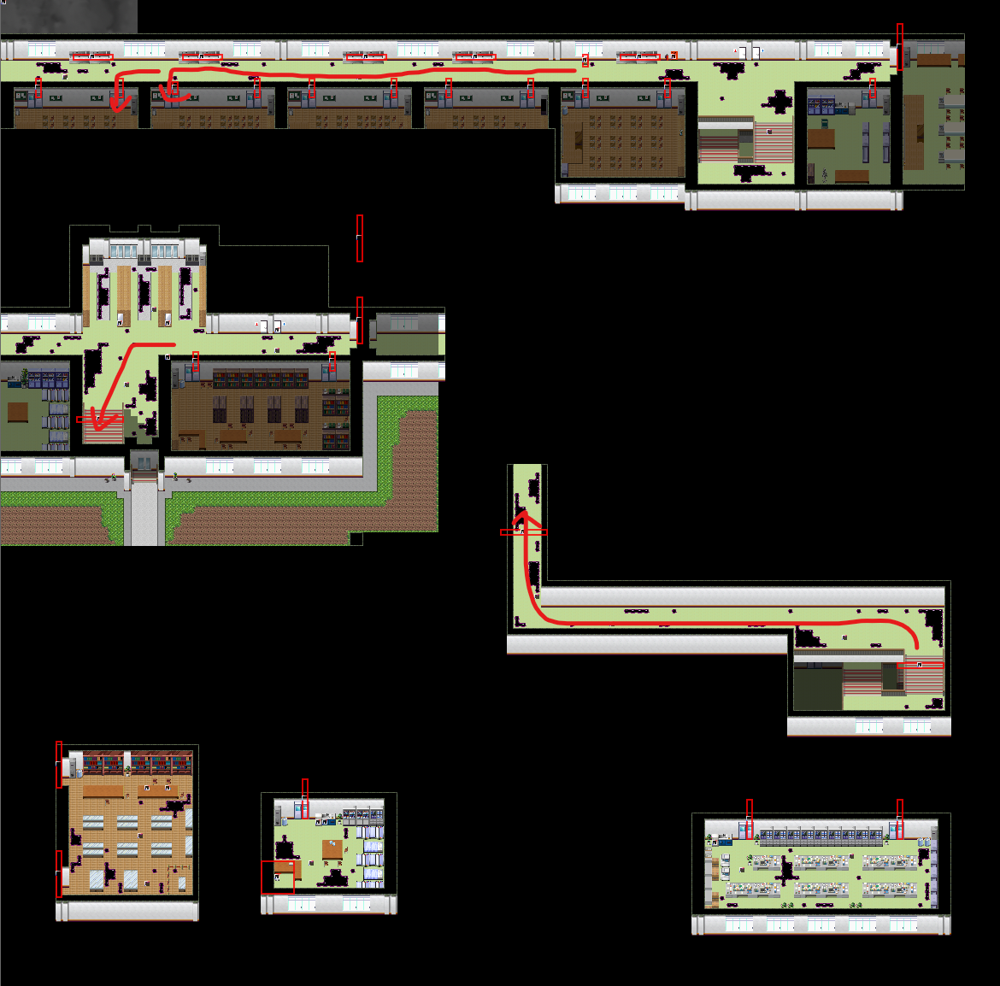

## 分からないところ

开头剧情后强制进入。从这里开始才可以存档。

## 木柚1

捡到**发卡。**

## 木柚2

教学：推拉物品

在可移动物品旁边按住Enter，再按方向键即可。~~（你已经学会了移动物品，接下来开始推箱子吧！）~~

## ？？？1

调查秋穹旁边的红色墙壁。解谜，详细方法问秋穹。

输入错误答案会触发**场景5。**

和豆豆对话后，再和秋穹对话，获得称号**萝莉控**。

## 木柚3

教学：后退

当背向时，某些墙壁会消失，按A后退即可通过。

## 木柚4

出口处选择道具：发卡（选择另外两个有对话）

## ？？？2

右下角捡到**手电筒**。

右下角调查红色书，解谜。

与鸡对话，获得**运动服**。

## 木柚5

按Q开启手电筒。

注意躲避混沌。

走廊左起第二个教室的房间垃圾箱有100日元。

地图：

## 木柚6

直接前进

## ？？？

选项：

- 右手：故事继续
- 左手：故事继续（会遇到四季。遇到四季的次数小于3次时，[出教学楼]()时才会先触发一次BE剧情，否则无法看到此BE的剧情）
- 双手：触发**场景6**，重开

结束后回到5-2教室，获得**橡胶挂件001**。
