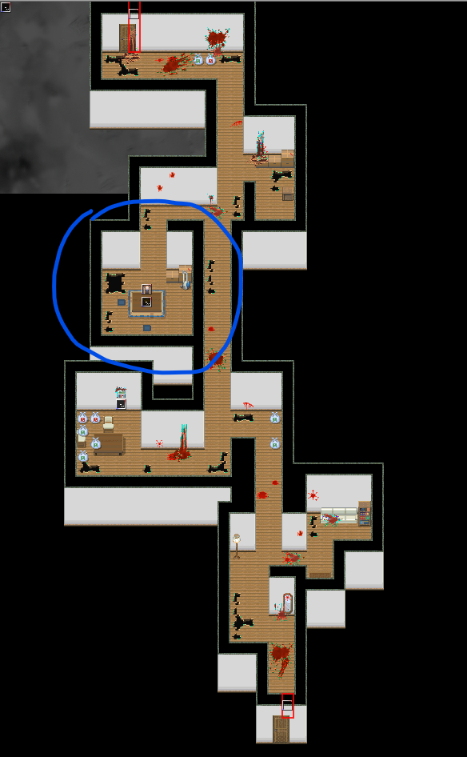
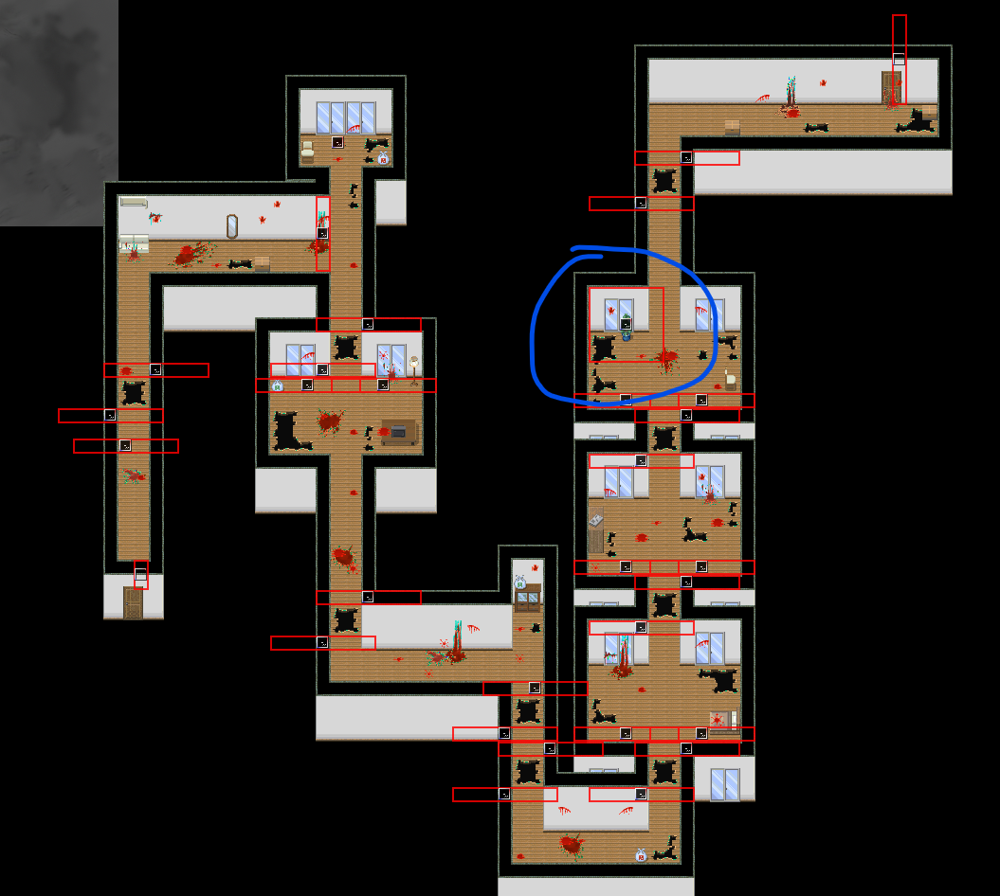
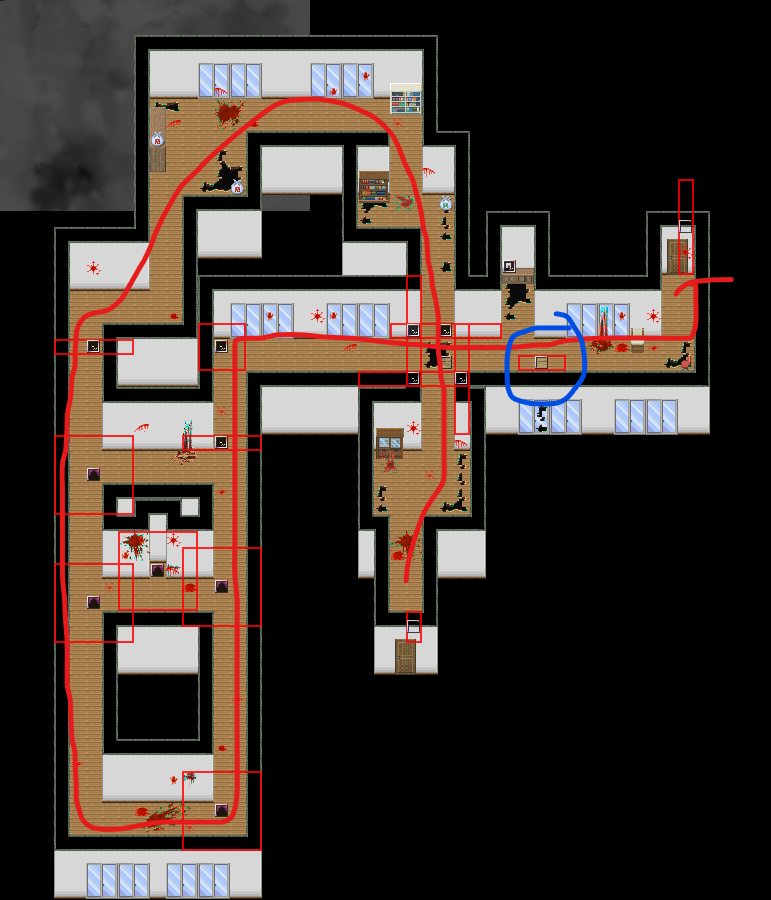
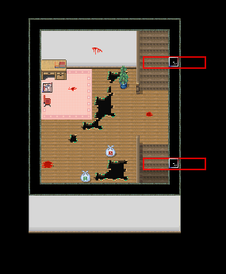
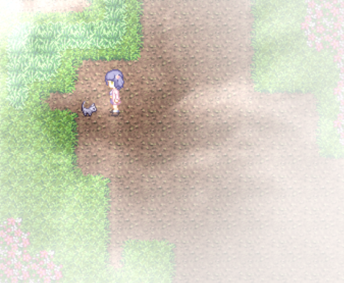

## 进入条件

从东侧或西侧的楼梯下到2楼，然后尝试3次下到1楼。

然后上楼梯，到达３Ｆ東階段？或３Ｆ西階段？

再上楼即可进入千子剧情。

## 分からないところ

直接走

## 千子1

走一半会有电话声，回到门口调查电话有点剧情。

## 千子2

**这里先不要找椎对话！！！**

如果在蓝色圆圈处找椎对话，椎会加入，导致后面一些剧情会消失（包括一个隐藏任务）。在千子5处的无限循环中和神秘人对话后再回来。

地图

## ？？？1

解谜，调查书架有说明。

解谜错误会触发**场景8。**

## 千子3

按D跳跃。注意避让混沌。

先进入下一个地图再返回，在跳过一个洞的房间的花盆里（地图蓝圈）有100日元。

地图：

## 千子4

左边有混沌逆时针巡逻。跟在混沌的后面移动到底部（怪的警戒范围为5*5的区域），向右边转，然后向上冲刺。多试几次就过了。注意在该地图内保存和读取后，由于混沌的运动混乱，会难以通过。离开地图或触摸混沌后重开会恢复。

通过后，可以将蓝圈处的木板推到洞口，之后就不用从左边绕了。

地图：

## ？？？2

解谜

与右上角木柚和风乃对话，获得称号**傲娇**。

## 千子5

之前如果没有找过椎，前进后会遭遇无限循环。无限循环中，这个地图左边有人可以搭话，在这里搭话完成**隐藏任务**。

按照对话，关掉手电筒按A后退下楼即可回到原来的地方。这时候再往回走到千子2找椎，就可以继续前进了。

## 千子6

直接前进。

## ？？？

先上2楼。

2楼右下角房间有道具**类似撬棍的东西**。

2楼右上角与椎对话（HE的必要条件）。

下楼，1楼左上房间的右下角有通往地下室的洞。

选项：

- 命令：重开
- 不命令：触发**场景2**后重开
- 告白：需要在2楼右上角与椎对话后才能触发，剧情继续。

告白后往下会遇到四季，然后回到教室。

## Clear 后

与千子对话进入内心，再对话传送到？？？。

2楼右上角，千子的桌子前面，300日元。

往回走到千子6，与猫对话获得**橡胶挂件059**。

