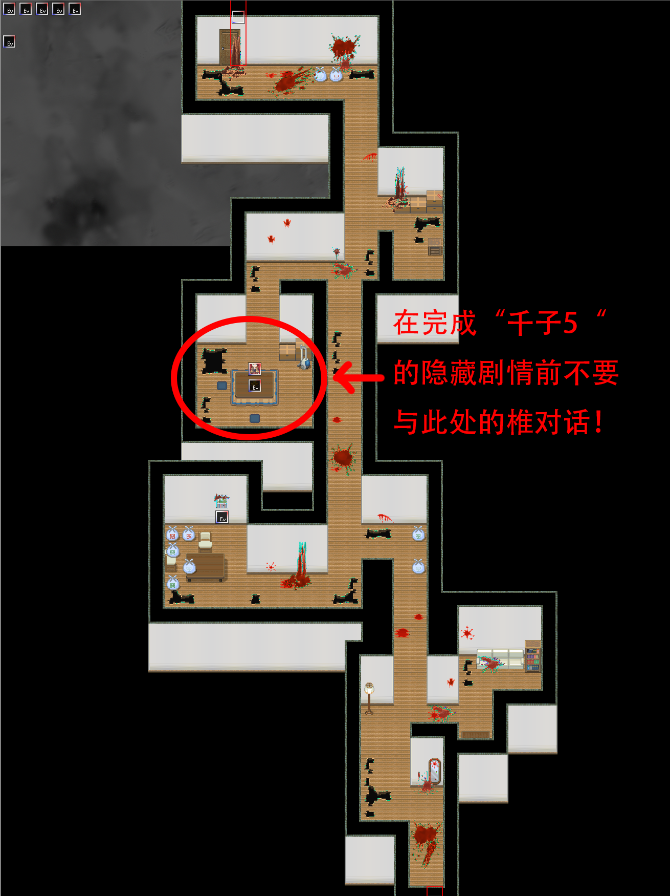
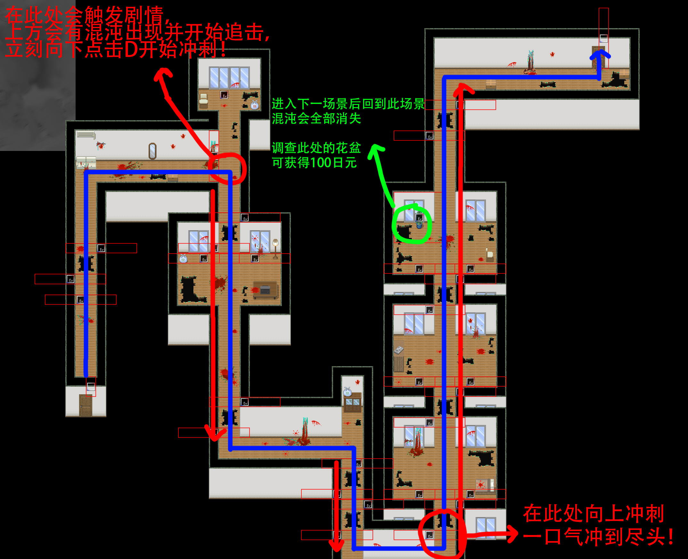
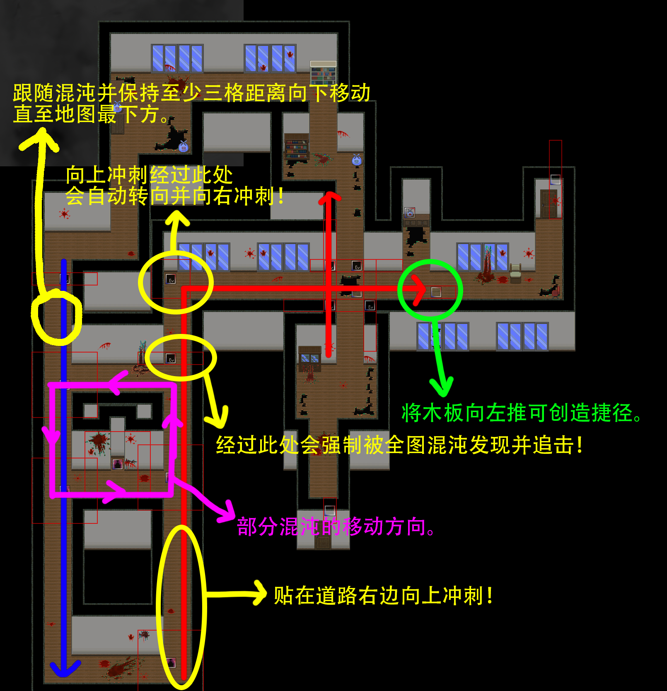
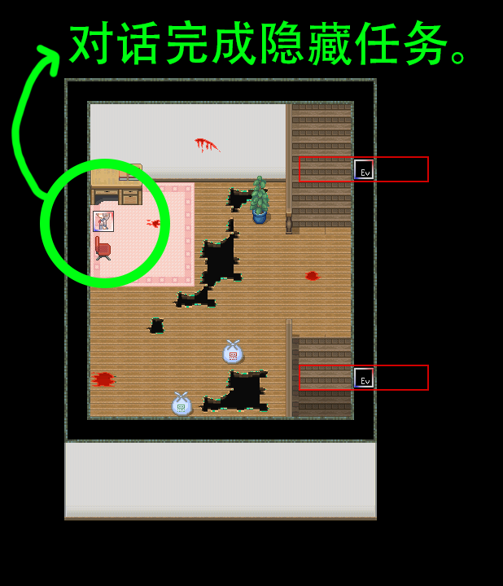
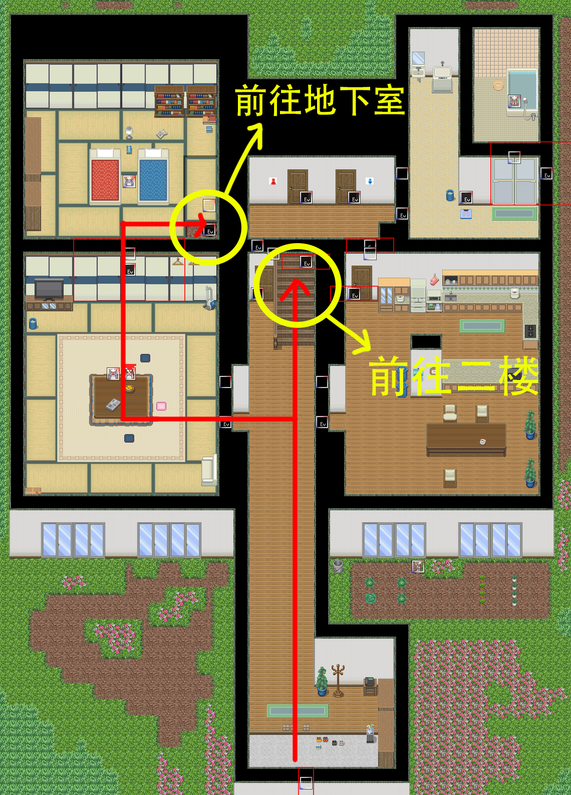
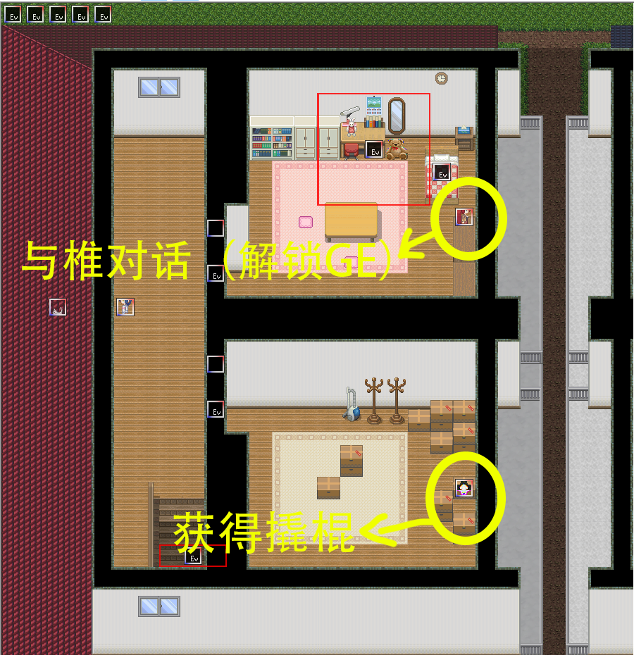
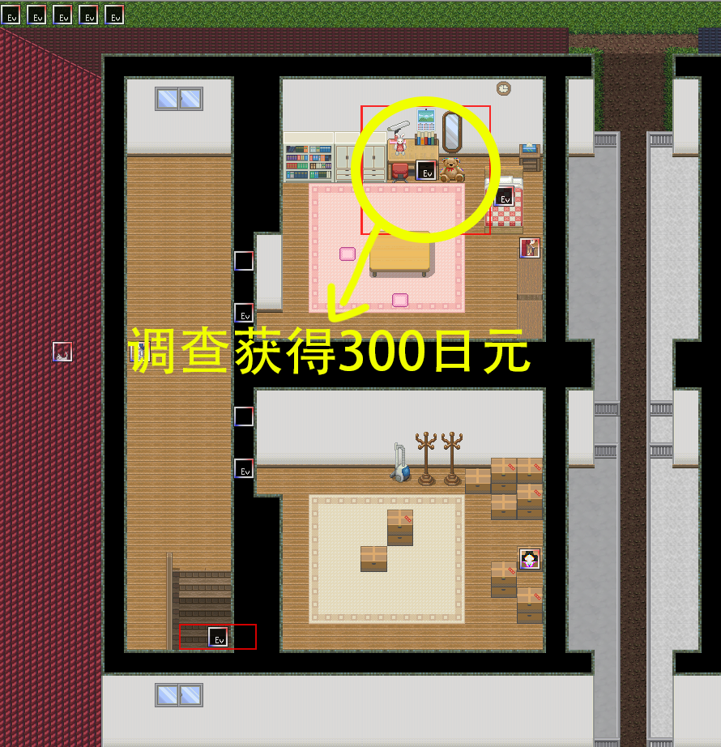
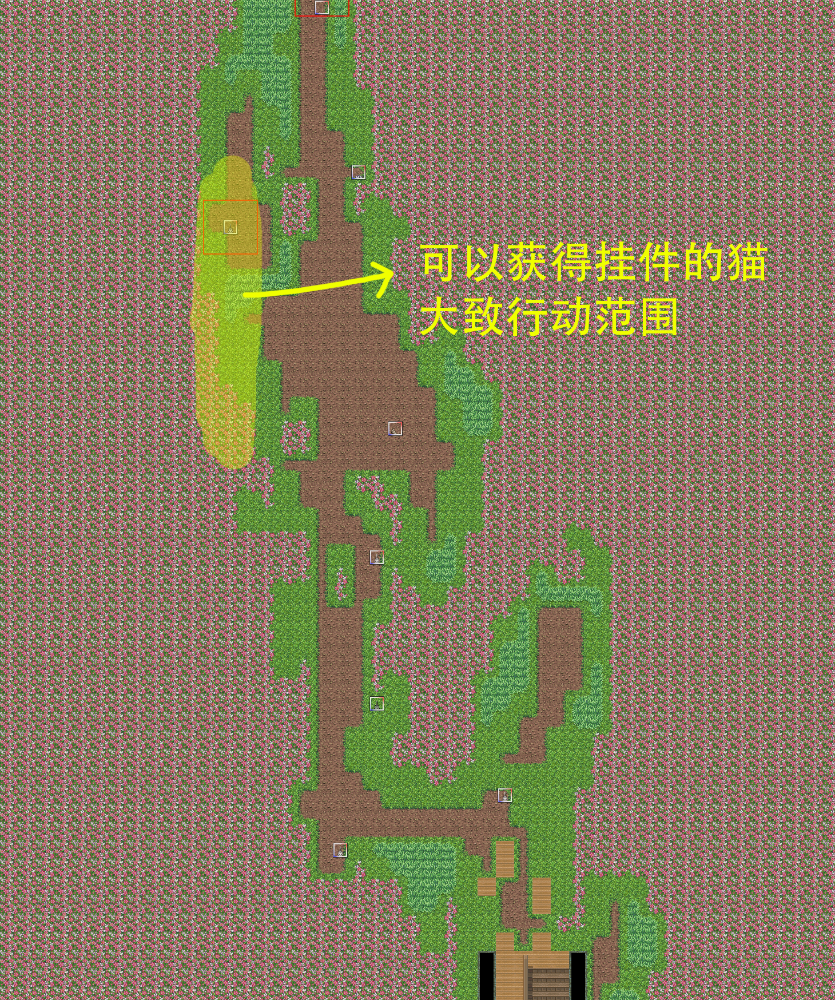

## 进入条件

从东侧或西侧的楼梯下到2楼，然后尝试3次下到1楼。（实际上无法下到1楼而是回到2楼）

然后上楼梯，到达３Ｆ東階段？或３Ｆ西階段？

再上楼即可进入千子剧情。

## 分からないところ

向上走

## 千子1

走一半会有电话声，回到门口调查电话有额外剧情。

## 千子2

**这里先不要找椎对话！！！**

如果找到椎并与其对话，椎会加入，导致后面一些剧情会消失（包括一个隐藏任务）。在“千子5”处的无限循环中和神秘人对话后再回来。

地图：

## ？？？1

解谜，调查书架可以查看操作说明。

解谜错误会触发**场景8。**

## 千子3

（如果没有在“千子2”中与椎对话，那么“千子3”与“千子4”均不会出现有关冲刺的教程与躲避混沌提示的对话。）

在面前有至少一格助跑距离时点击（注意不是按住）D即可向前冲刺，双击D或单击A可取消冲刺。冲刺状态下可以跳过部分缝隙。

注意避让混沌，具体行动攻略参见下面的地图。

当成功通关一次本地图后，本地图的所有混沌会消失。

先进入下一个地图再返回，在跳过一个洞的房间的花盆里有100日元。

地图：

## 千子4

沿路径移动，中途可冲刺跳过一个两格宽的缝隙。

左边有混沌逆时针巡逻。跟在混沌的后面移动到地图最底部（怪的警戒范围为5*5的区域，也就是需要离混沌至少三格远才不会被发现）。本图混沌的移动速度与玩家行走速度相近。

向右边转，然后向上冲刺。冲刺到中途会强制让你被全图敌人发现，因此不要停止冲刺。冲刺到最上面后会自动转弯向右冲刺，直至跳过两格宽的缝隙。

上述方法会有一定的运气成分，多试几次就过了。（具体路线见下图）

注意在该地图内保存和读取后，由于混沌的行动轨迹会变得更加混乱，会难以通过。离开地图或主动触摸混沌后重开会恢复。

当成功通关一次本地图后，本地图的所有混沌会消失。

通过后，可以将蓝圈处的木板推到前面跳过的两格缝隙处，创造前往终点的捷径。

地图：

## ？？？2

解谜。

与右上角木柚和风乃对话，获得称号**傲娇**。

## 千子5

之前如果没有与椎对话，前进上楼梯后会进入由六种房间布局组成的无限循环中。

六种房间布局的其中一种（见下图）左边有人可以对话，在这里对话完成**隐藏任务**。

按照对话，关掉手电筒按A后退下楼即可回到“千子5”最初的地图。

到千子2与椎对话，回到“千子5”向前走上楼梯就可以继续前进了。

## 千子6

沿着路径前进。

## ？？？

先上2楼。

2楼右下角房间调查闪光的箱子获得道具**类似撬棍的东西**。

2楼右上角房间与椎对话（HE的必要条件）。

下楼，1楼左上房间的右下角有通往地下室的洞。

进入地下室后向上走触发剧情。

选项：

- 命令：于？？？一楼的电视处重开
- 不命令：触发**场景2**后重开
- 告白：需要在2楼右上角与椎对话后才能触发，剧情继续。

剧情结束后后往下会遇到四季，然后回到教室。

## 通关后

与千子对话选择进入内心，打开菜单对话选择“更深入地潜入”传送到？？？。

回到2楼右上角的房间，调查千子的桌子前面可以获得300日元。

往回走到千子6，接近一只在地图左边缘移动的猫对话获得**橡胶挂件059**。

地图示例：

