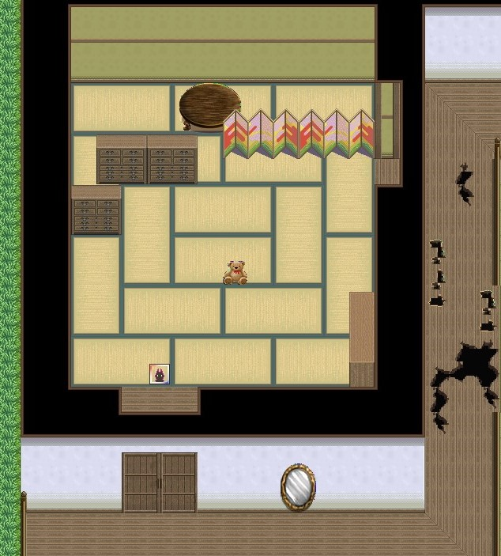
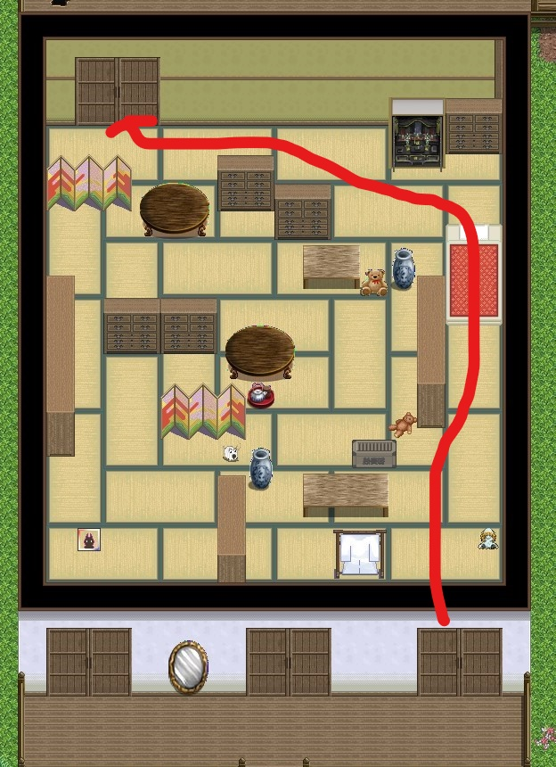
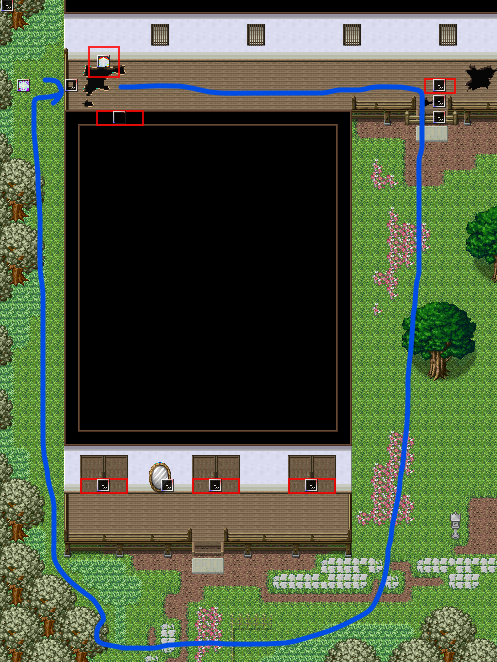
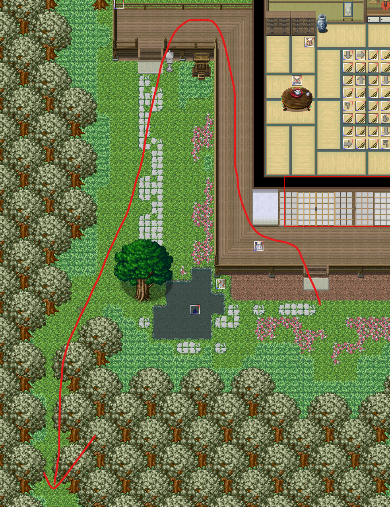
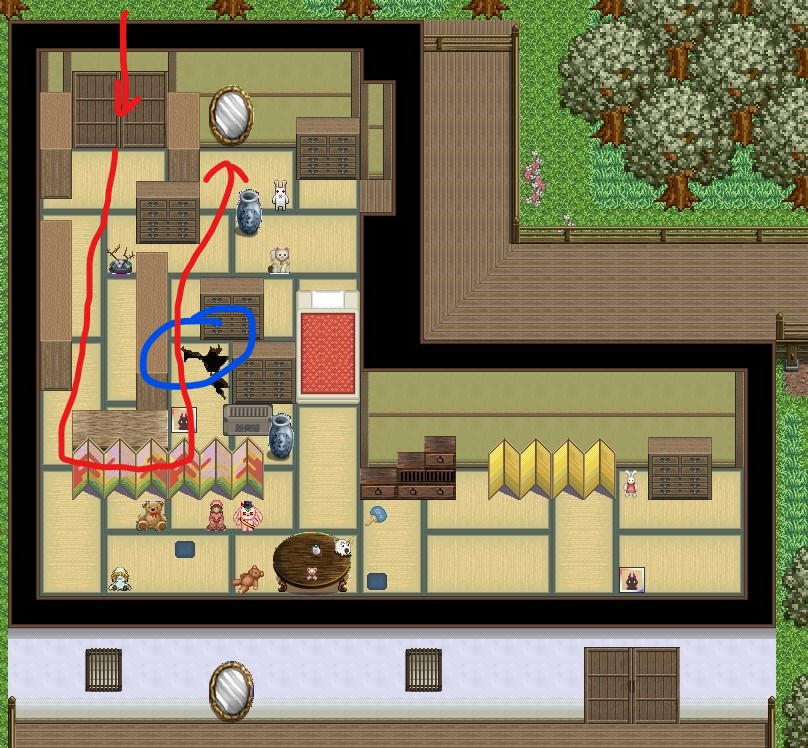
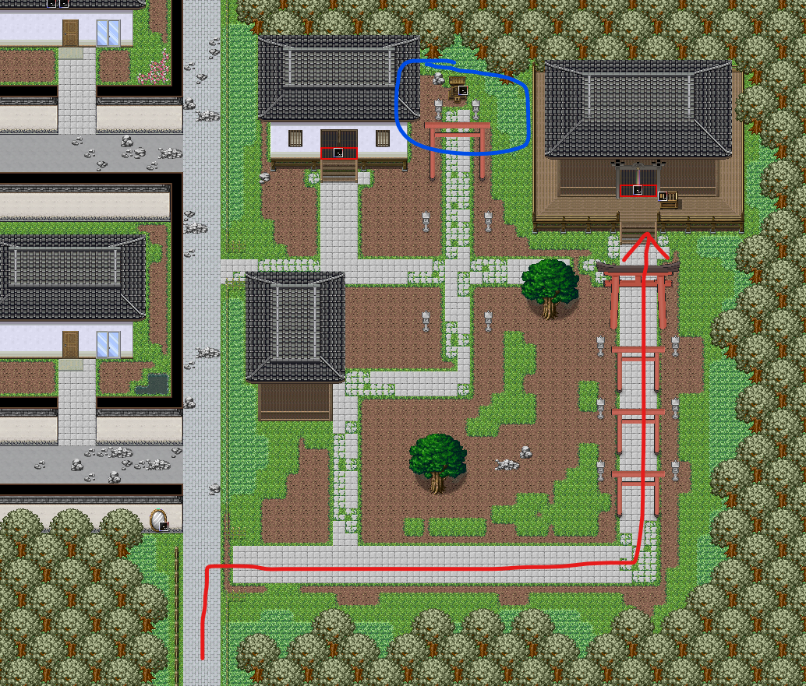

## 进入条件

将电脑系统时间调为7点或19点，调查教学楼１Ｆ東階段时钟对面的镜子。（只有通关了千子剧情才可以下楼）

## 分からないところ

直接前进。

## 雪奈1

直接前进。

## 雪奈2

隐形迷宫，调查镜子可以查看镜像后的地图。迷路了的话按E键回到入口~~（一次要付一个吻的代价）~~。

镜像前的地图（右上为出口）：

地图上的混沌为镜子中的演示动画用，实际的地图中没有，不用在意。

出去后向下有一个木板，往下推填上洞，之后就不用走这个迷宫了。

## ？？？1

解谜

解谜错误、且携带了[手铐](07心羽.md)，会触发**场景13**。（要是没有满足条件，通关雪奈剧情后触摸最深处的混沌也可观看）

衣柜和书架之间有100日元。

## 雪奈3

隐形迷宫，调查镜子可以查看镜像后的地图。

镜像前的地图：

出门后，有**隐藏任务**用的关键道具**小化妆镜**，但是够不着，需要选择道具才能获得。

- 捕虫网：获得镜子（菲亚支线）
- [类似撬棍的东西](03千子.md)：绕过去，在洞旁边调查获得镜子
- [大棒](07心羽.md)：绕过去，在发光处获得镜子

从右上角前往雪奈4。

## 雪奈4

雪奈左边的镜子可以看到房间镜像后的地图。这个房间中有**隐藏任务**！

与雪奈对话后地图会变透明，且镜子会无法再查看。

**隐藏任务：**

从 ？？？2的左边绕回雪奈4：

进房间，走到镜子前的白毛处对话。

（蓝圈处需要先后退一点，然后按D跳过去。不太好跳，多试几次）

选择道具：

- [类似撬棍的东西](03千子.md)：不要选！！！选了后隐藏任务失败。
- [小化妆镜](04雪奈.md)：任务成功。
- [手电筒](02木柚.md)：只发生对话。

## ？？？2

解谜。

左下角可以返回雪奈4的另一侧。

## 雪奈5

路上会遇到四季。

## 雪奈6

隐形迷宫。镜子可以看到房间镜像后的地图。

蓝圈处有**橡胶挂件036**，可以等通关雪奈支线、迷雾消散后来收集。

## ？？？（最深部）

选项：

- 为了停下来，一起努力吧：触发**场景14**后重开
- 就这样一直下去吧：通关，获得称号**气味控**
- 兔酱才没有讨厌你呢：重开

## Clear后

教室里对话雪奈，选择带走。

1F東階段往左第二个房间（用务员室）门口获得**万能钥匙**。万能钥匙是出教学楼的关键道具。

从左下角门前往广播室然后返回，离开用务员室时会有剧情，在广播室会遇上兔兔。
