## 进入条件

需要先通关雪奈线。教室里对话雪奈，选择带走。

前往2F的家政教室（最左边），剧情后触摸左边的混沌，开始剧情。

## 分からないところ

直接前进。

## 兔1

将左边的熊移动到与右边对称的位置。

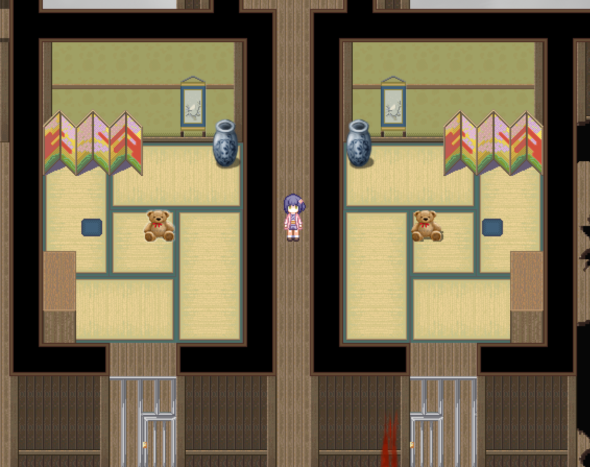

调查左下的铁门，选择[万能钥匙](04雪奈.md)关掉门。

之后中间关闭的铁门会打开，继续前进。

## 兔2

左边的架子上：100日元

调查左边的铁门，和兔兔对话。（如果之前没去广播室和兔兔对话，这里的对话会不同。）

移动房间内的物品，与右边房间上下对称。（罐子比较难移，按照图中的绿线推\拉。其他两个很好移。）成功后会有提示音。

**兔2、3、4的移动物品的谜题都可以不完成直接前进，但全部完成后才能在兔5中收集到橡胶挂件031。**

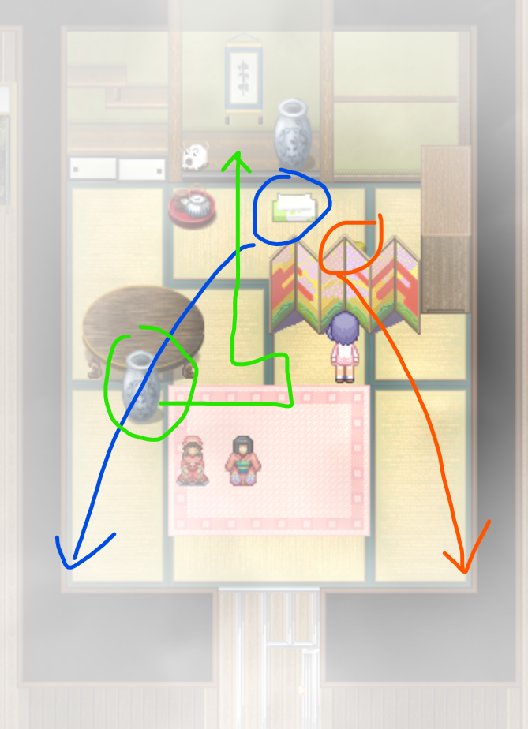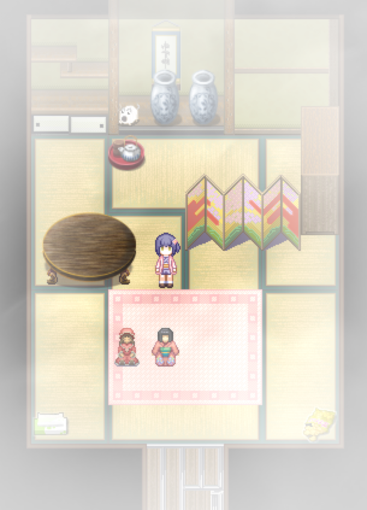

调查这里，兔兔会去按开关。

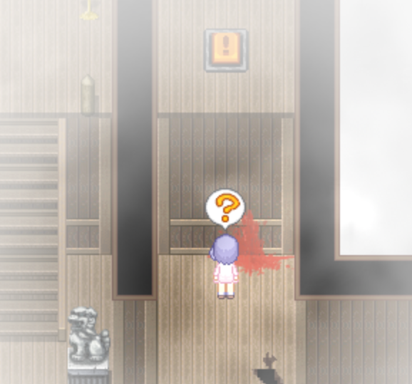

## ？？？3

解谜

解谜错误会触发**场景34**。

从入口往左的草坪走，跳过河流走到左上角，100日元。

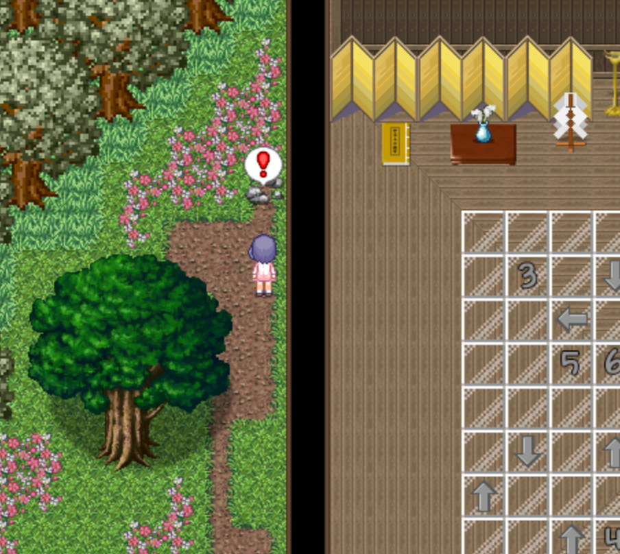

## 兔3

与前面几个图一样，拖动物品达成对称，不过是困难版……

右边有三个房间，要求房间2的物品左右镜像后与1重合，房间3的物品上下镜像后与1重合。带血的桶要从蓝圈中搬过来，有一个人体零件要从2中搬过来。

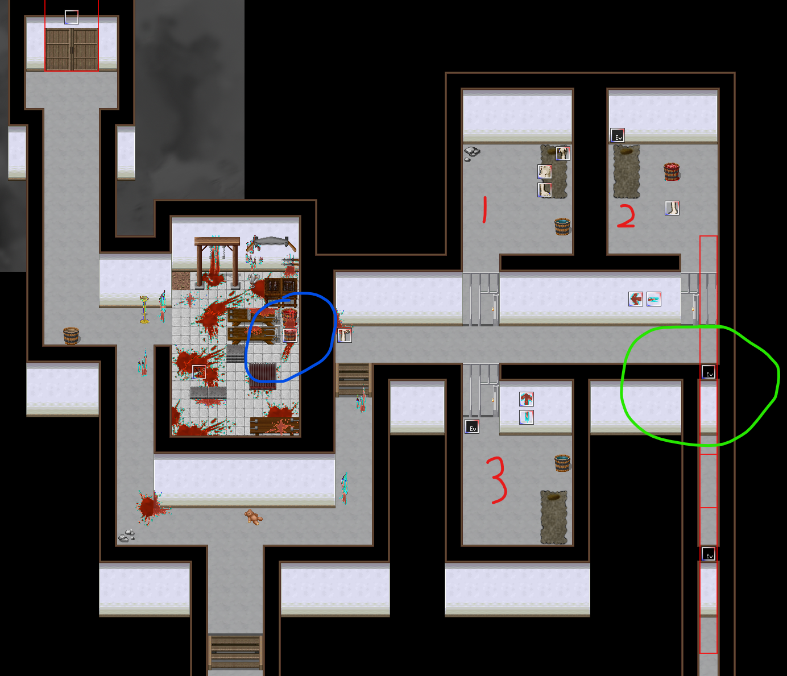

最终房间1内的效果：

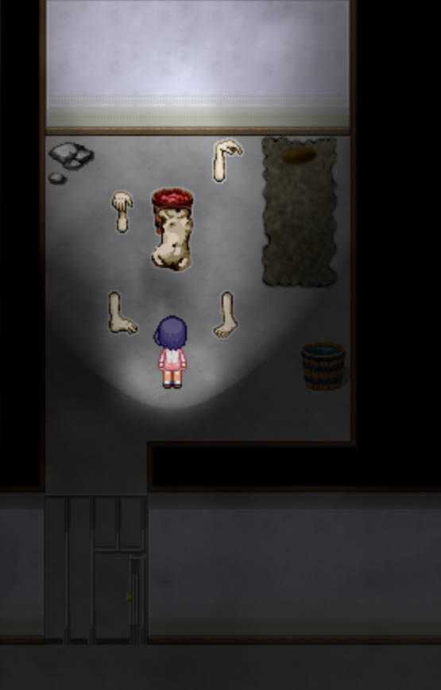

正确后会有提示音。

绿圈中为**隐藏任务**。背对墙时墙会消失，按A倒退进入隐藏房间。与白毛对话。

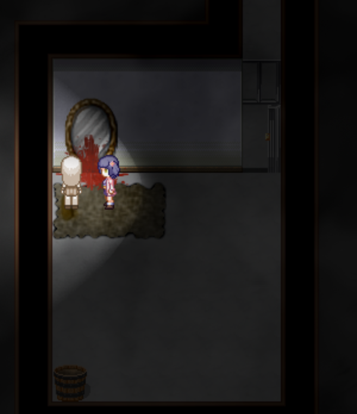

选择“那个人……”，完成隐藏任务，展示室中的灯点亮。（只有完成雪奈线中的隐藏任务后才会有这个选项）

## 兔4

推箱子。正确完成时会有提示音。

比较繁琐，但是不算难，除了放最后一个箱子时容易出错外不容易卡死。如果陷入死局了的话回到兔3再进入地图即可。

先把外面的任意两个箱子挪到底下两格，然后把中央附近的箱子拉到右上那一格：

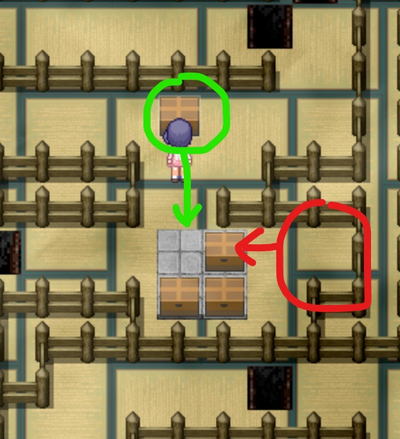

把最后一个箱子弄到如图位置，往下拉，然后从左边跳出去，绕到上方把箱子推到归位即可。最后记得关门，听到提示音再往前走，不然还得重新来。

## ？？？4

解谜。

左边：100日元

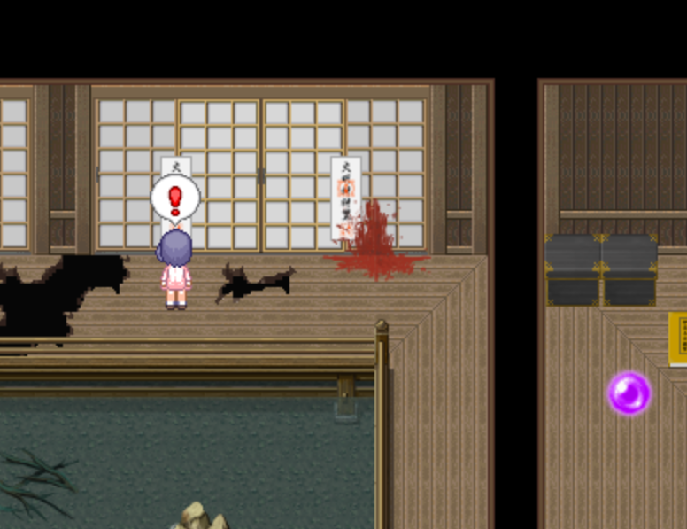

## 兔5

如果2、3、4中的谜题都完成了，这三个门都会打开。

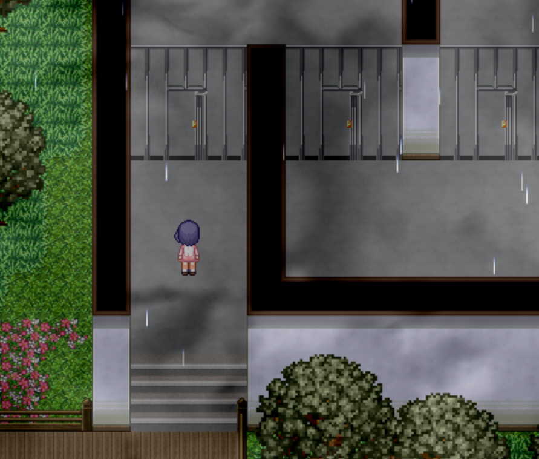

拉开绿圈处的箱子，在红圈处获得**橡胶挂件031**。

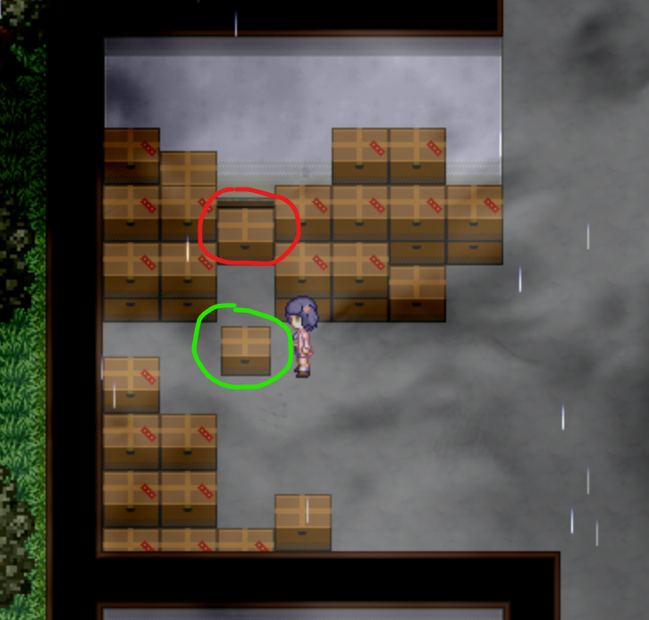

箱子移动到门边上的按钮上即可开门。

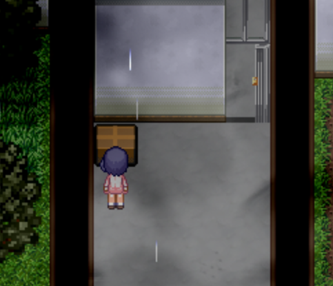

如果没有完成兔2、3、4，也能从左边绕过去。

## 兔6

左右对称即可解锁中间的门。

调查左边中间的石台，让三个人站上去。

去右边开门。此时两边对称，中央的门打开。

也可以左右的门全都锁上，这样中央的门也会打开，不过之后会因为雪奈无法出现而BE。

## ？？？（最深部）

如果在兔6中锁上了门，触发**场景35**后重开。

如果没锁门，通关。
