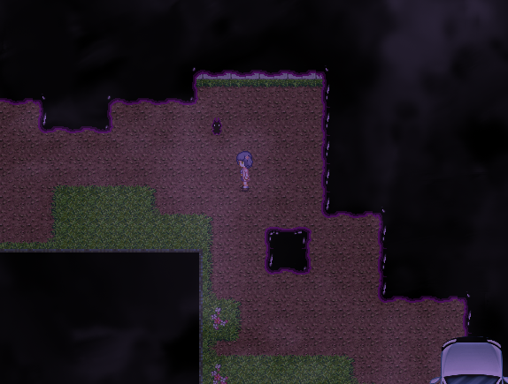
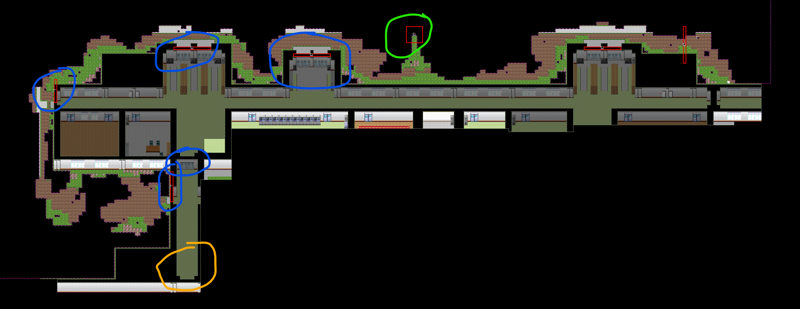
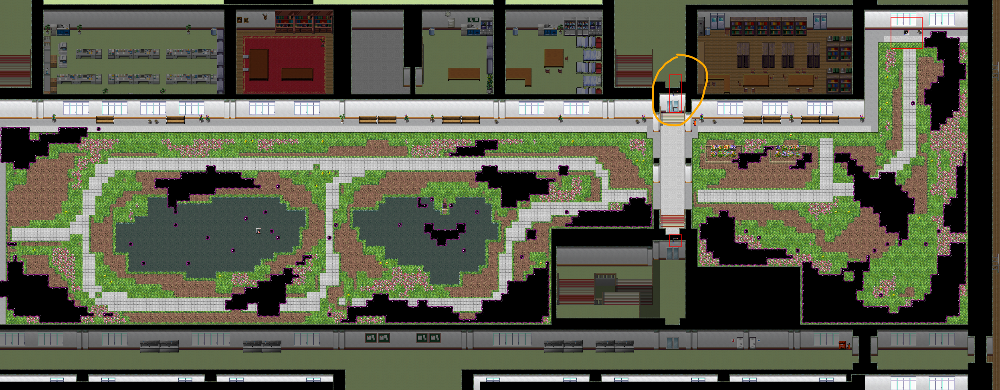
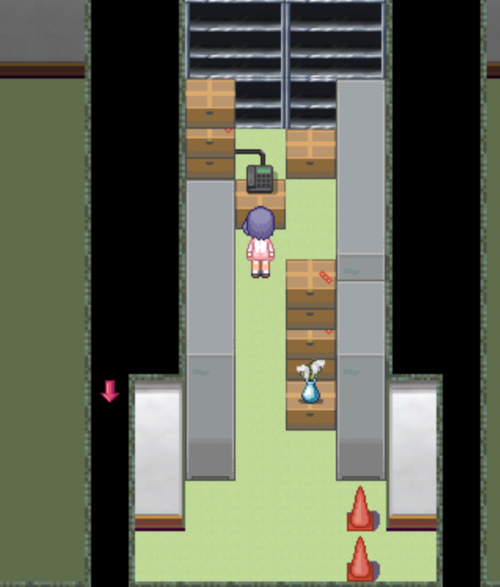
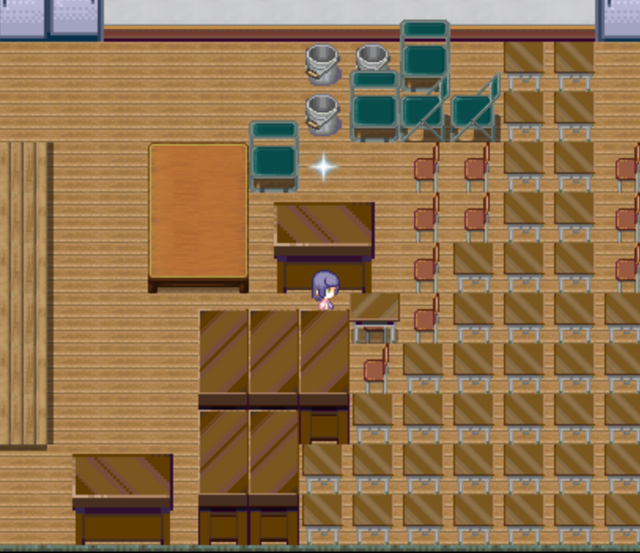

## 出教学楼

获得万能钥匙后即可从1F東階段上方出教学楼。

如果遇见四季的次数小于3（在木柚线不能选左手，否则至少遇到三次），出教学楼会触发BE，并触发**场景1**。该场景之后可在教学楼右上方观看。

再尝试一次出教学楼，或遇见过3次四季，会正常进行剧情。

之后就可以出教学楼活动了。

## 校舎裏昇降口

绿圈处可以收集**橡胶挂件017**。

蓝圈处可以从外面打开一些之前打不开的门。

黄圈处可以前往南教学楼。

## 中庭

黄色圆圈处可以从外面打开一些之前打不开的门。

右上角红色方框处收集**橡胶挂件013**。

## 南教学楼

体育馆在右侧，只能先从南教学楼进入，清理上方门口的桌子后才能从北教学楼进入。

南教学楼2F的最左边是第一手工室，当通关菲亚线、获得捕虫网（待添加超链接）后，收集到的回想可以在这里看。

手工室旁边的手工准备室里可以用电话呼叫队友加入队伍。

## 北教学楼的收集

这里顺便补充一下之前漏掉的北教学楼中的一些收集要素。

2F西階段右侧第二个教室（空教室）：

拉开这个桌子，闪光处获得服装**附加内容**（可以自定义服装）。

2F最右侧：展示室，显示隐藏任务的完成情况。0.48版本一共有7盏灯可以被点亮。
