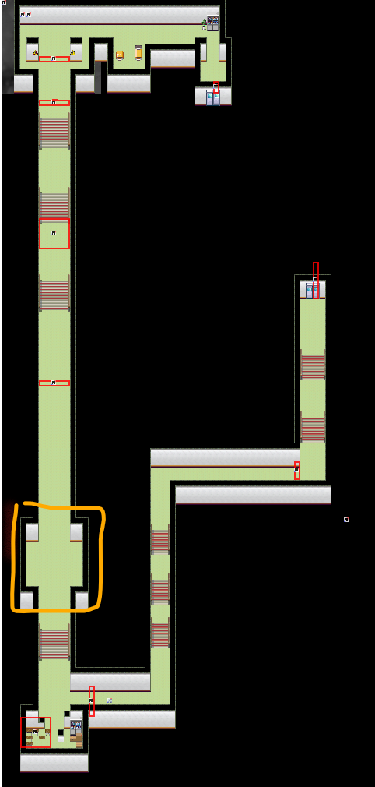

## 进入条件

*这条线通关后会获得回收cg的关键道具捕虫网，建议尽早完成。*

*找5-2教室的鸡对话可以更换游戏中的白天和晚上。*

晚上去掉调查3楼最右边的理科教室。

理科准备室（理科教室左边）、3楼东侧女厕所的用具室、6-2教室（从5-2教室往左走）的右侧、6-2教室的讲台各有一部分人体模型零件。

找齐后，晚上再去调查人体模型，跳出一个混沌，触摸混沌进入剧情。

## 分からないところ

直接前进

## 菲亚1

出口前左边岔路，培养槽中100日元。

## 菲亚2

非牛顿流体坑需要冲刺过。经过箭头木板会转向。

这里需要靠右冲刺，通过右转木板转向。

## ？？？1

解谜

解答错误且携带有[类似撬棍的东西](03千子.md)，触发**场景15**。

## 菲亚3

### 水池1

先靠右冲刺，到左边控制台，将木板调节为向右，靠下冲刺到右边控制台。

右边控制台可以用方向键移动木板，将木板移到一个不挡住出口的地方。

回到左边，将木板调为向上。

靠下冲刺来到上面的通道。

### 水池2

向上走能直接继续剧情，但是右侧岔路有**隐藏任务**。

1、右侧水池，控制台移动木板到以下位置：

靠上冲刺来到右侧通道，注意按D刹车。

2、右侧通道控制台旋转木板：

3、靠下冲刺回到左侧，调左侧控制台：

靠上冲刺来到下方通道。

4、下面水池靠左冲刺直接过。

5、沿着道路尽头有个控制台，按一下，拉一下。

6、靠左冲刺回到最开始的左侧通道

7、按照1中的方法，在控制台移动木板，靠上冲刺到右侧通道。此时右侧通道后面的水池可以冲过去了。冲过去后道路尽头有个培养槽。对话。

培养槽中女孩敲的是摩斯电码：・－－・　－－－　・－・－－　・－－・　・－・－－　（つれてつて）

需要用摩斯电码回应：－・・・　・－ （はい）

即：咚咚、咚、咚、咚、空、咚、咚咚

隐藏任务完成。

## 菲亚4

调查这里发光的东西，引开怪。

## ？？？2

解谜

与风乃对话，选择道具，选择[大棒（树枝）](10心羽.md)可以获得称号**犬娘**。如果之前没有进行心羽线，之后记得来回收。

## 菲亚5

冲刺通过长廊，在黄色框处往两侧躲避。

底部红色方框处：100日元

往回走，长廊中间红色方框处：**橡胶挂件037**

## 菲亚6

调查桌上的书，可以阅读菲亚的研究日志，一共4篇。

## ？？？ （最深部）

右侧岔路通往[菲亚＆白纱奈EX](09菲亚&白纱奈EX.md)。需要通关白纱线后和白纱一起来才能进去。

直接前进，与菲亚对话触发剧情。

选项：

- 帮忙：重开，如果队伍中有心羽，触发**场景16**。场景也可以在过关之后触碰这里的混沌观看。
- 不行：过关
- 干掉夏亚：重开

## Clear后

找菲亚对话，得到**捕虫网**。

找已通关的角色对话，选择进入内心，再在菜单中选择对话，选择更深入的探索，找到混沌进行捕捉，即可在南教学楼的[第一手工室](06出教学楼剧情.md)观看回想。出教学楼后教学楼右上方也有一个回想。

理科准备室的桌子上出现菲亚的研究笔记，补充设定。（没有翻译）
