## 触发条件

带上菲亚，前往音乐教室（3F最左边）。调查钢琴。

进行剧情时建议也带上菲亚，这样许多关卡会变简单，而且结局处只有带上菲亚最后才能HE。

## 分からないところ

直接前进。

## 白纱奈1

右边小路的柜子：100日元

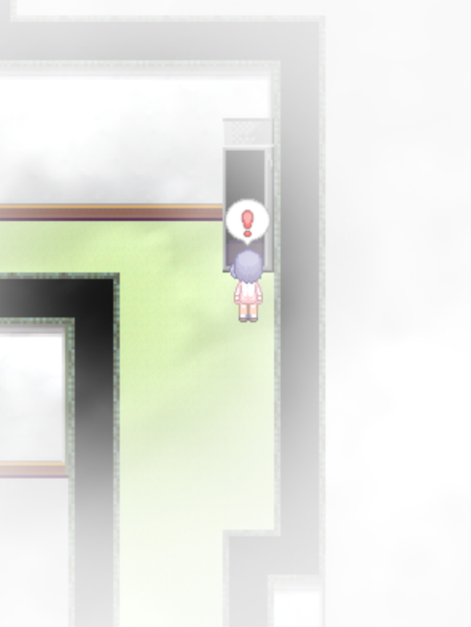

出口前的右侧岔路的钢琴：调查获得**钢琴的白键**（隐藏剧情相关的重要道具，1/4）

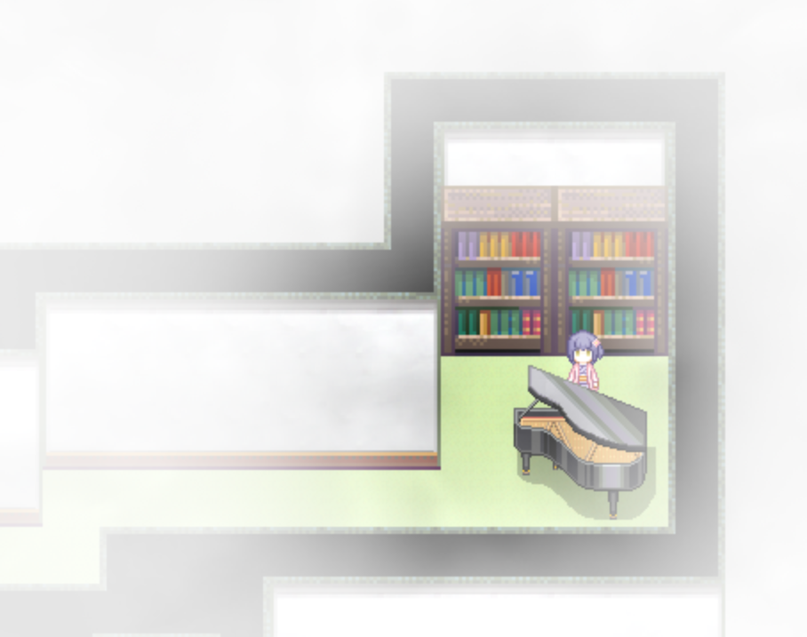

## 白纱奈2

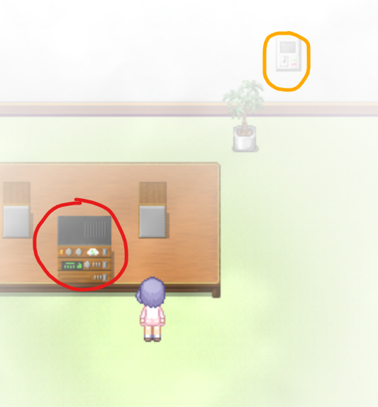

红圈处播放音乐，黄圈处调节音符与播放的音乐一致。

从左至右音符上移次数为1、4、7。

然后冲刺过水槽，音符正确时墙壁会自动消失。

## ？？？3

解谜

解谜错误会触发**场景23**。

调查钢琴获得**钢琴的白键**（隐藏剧情相关的重要道具，2/4）

左下角：100日元

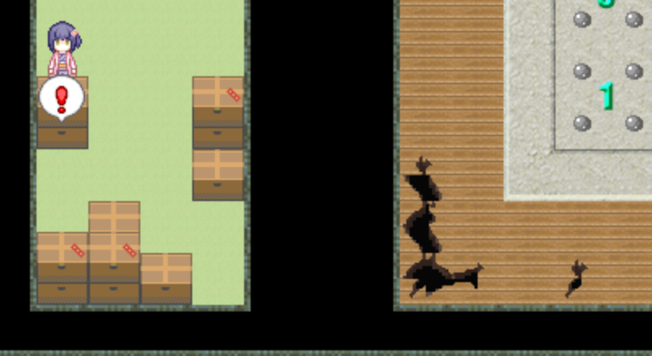

## 白纱奈3

带上菲亚的情况：问号处，调查一次，然后再调查一次。

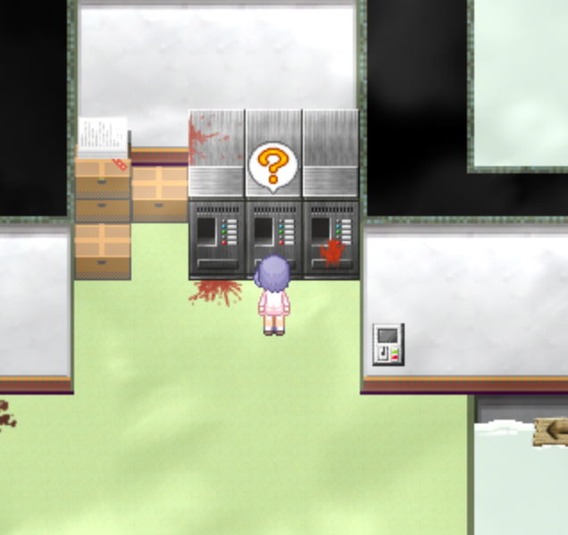

控制台调节，箭头往下，冲刺，尽头处垃圾桶有**橡胶挂件**。对着向下的木板往回冲。

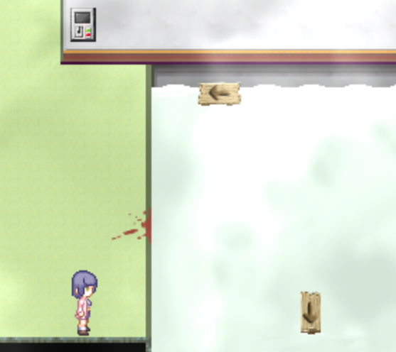

不通过木板，冲刺到右边。向上就可以继续剧情。

没带菲亚的情况：左边用于消灭怪物的控制台无法操作，直接冲会重开。

左边向上走有两组播放音乐、控制音符的操作台。

靠下的一组从左往右音符上移的次数：3、4、3、3

靠上的一组从左往右音符上移的次数：3、3、2、9

控制台调节，箭头往下，冲刺，尽头处垃圾桶有**橡胶挂件**。如果音符正确，墙壁会消失。

往下走有个控制台，按一下再拉一下，之后就不用绕路了。向上就可以继续剧情。

## 白纱奈4

听到心跳声，说明附近有陷阱，踩上去就重开。

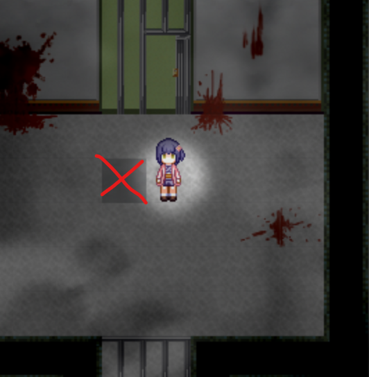

使用发卡开门。~~（不是有万能钥匙吗，怎么不用）~~

右边有**隐藏任务**。正确移动音符后往右冲，尽头处墙壁消失，有隐藏房间。

音符从左往右上移次数：1、9、2、3、9、1、9、3、9、1、9、3

去隐藏房间的路上注意陷阱。

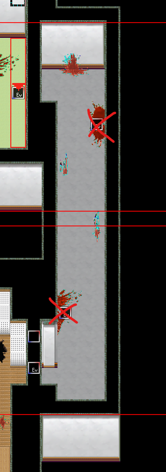

将钢琴的白键放入房间中的钢琴，每放一个有1段剧情。目前只有2个白键，后面还有两个白键，记得在**完成白纱奈剧情前**回来。

## ？？？4

解谜

与豆豆对话，获得称号**服从欲**

调查钢琴，获得**钢琴的白键（3/4）**，记得及时回到白纱奈4的隐藏房间里放回去。

## 白纱奈5

注意陷阱（根据心跳声判断）

蓝色的x为陷阱

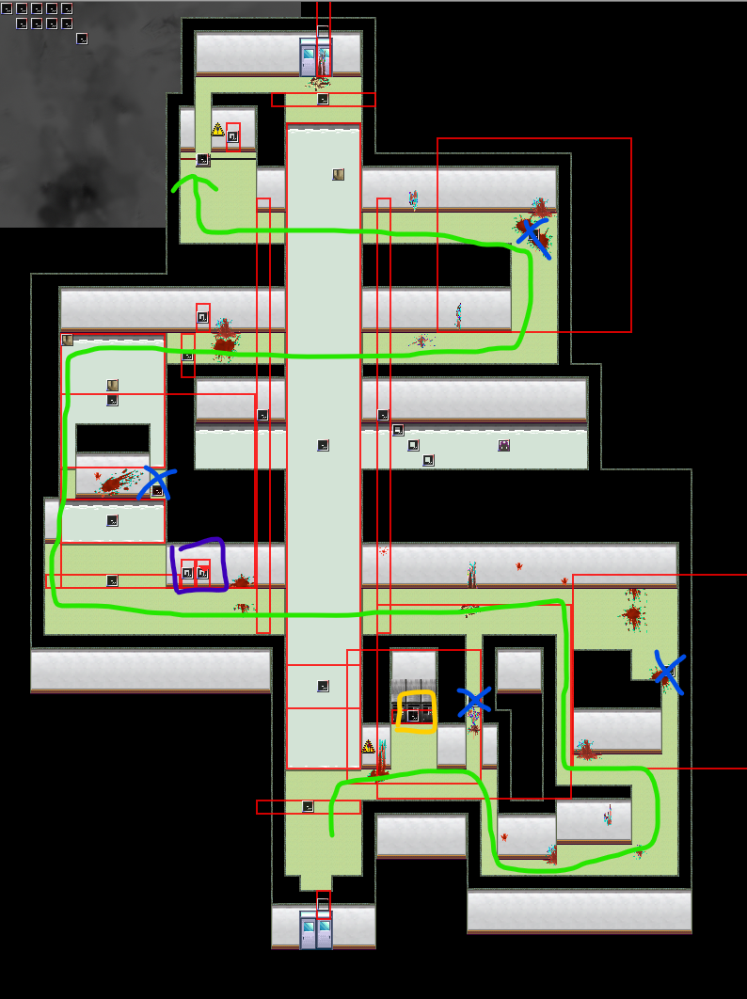

带着菲亚的情况：入口左侧控制台（黄色框），调查一次，再调查一次，直接往前冲到底。

没带菲亚：没法启动黄色框内的控制台，中央池子有怪，需要绕路，按照绿色路线，注意避让陷阱。

紫色圈处调节木板：（左边调方向右边调位置）

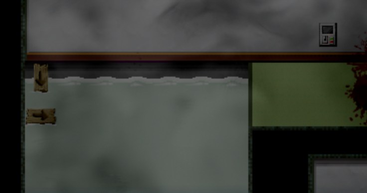

从左边冲。最终到达右上角电操作台，按一下拉一下，杀死怪物：

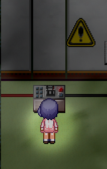

木板操作台移动木板：

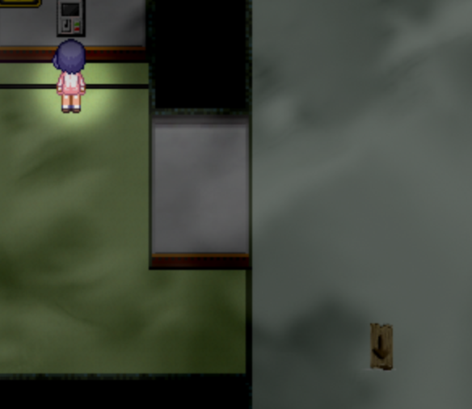

对着木板冲刺回到下面，然后避开木板往上冲刺，即可到达出口。

## 白纱奈6

画面逐渐变暗

## ？？？

先摸黑调查门口左边的钢琴，获得**钢琴的白键（4/4）**

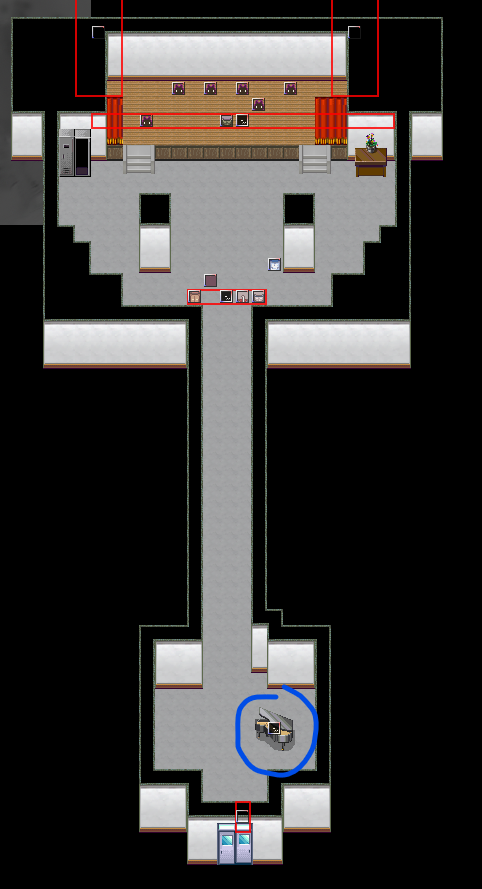

直接掉头回到白纱奈4的隐藏房间，完成**隐藏任务**

隐藏任务完成后陷阱消失

回到？？？，往前走触发事件。

如果没带菲亚：触发**场景24**后重开

带上菲亚：过关
