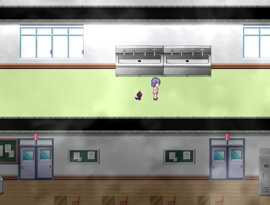
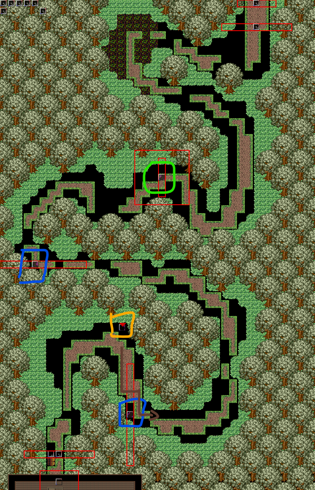

## 进入条件

3F东階段左侧走廊一直往左走(或者3F西階段往右侧走廊走)，路上会发现有混沌跟在身后，撞上去即可进入剧情。

## 分からないところ

直接前进。

## 心羽1

直接前进。

## 心羽2

直接前进。

路比较黑，终点处的门不太容易看到。走到尽头按回车进入下一地图。

## ？？？1

解谜

解谜错误触发**场景4**

拉开绿色凳子，对话豆豆获得称号**喜欢狭小空间**

## 心羽3

黄圈处可对话，获得提示（别……别看这边……）

蓝色圈中的怪，在红框范围内与其对视就会重开。第一只可以绕路，第二只需要背对着怪按A倒退着接近，然后向上绕开。

绿圈中的怪，接近后会追在后边，但是只要不对着它所在的方向就不会有事。只要小心别被堵进死路就行。

## 心羽4

这个地图中有大量会追在后面的怪（所有红色正方形方框中都是），小心规划路线避免被堵死，走入了死路就只能从地图开头重新开始了。

左边岔路是死路，但是蓝圈中有道具**大棒**（树枝）。如果之前通关了[菲亚](07菲亚.md)线，之后记得在菲亚线的？？？2中选择该道具回收称号。

前半段只有一个怪，比较简单。后半段尽量靠左走（黄色路线），防止怪把左边的路堵死。

## ？？？2

解谜

从左下角的这里按enter能进入，红圈处有100日元

## 心羽5

直接前进

## 心羽6

木柚单独行动

往右再往下（红色路线），回到心羽5

右侧为通往[心羽＆美澄EX](12心羽&美澄EX.md)的路线，目前不能通过

## 心羽5（木柚单独行动）

直接前进，会看到其他人，但在路过铁轨时被火车碾死

在蓝圈发光处前调查触发剧情。选择去捡一下，完成**隐藏任务**

之后通过铁轨不会死，但是其他人也走了，没法汇合。

继续前往心羽6，沿道路前进。

## ？？？最深部

选项：

- 美澄的事：过关
- 心羽的事：重开
- 冬璃的事：触发**场景9**，重开

## Clear后

重新回到心羽地图的最深处，获得道具**手铐**
