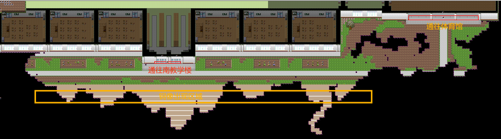
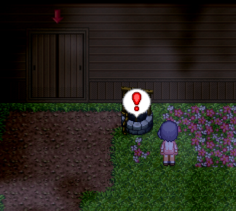
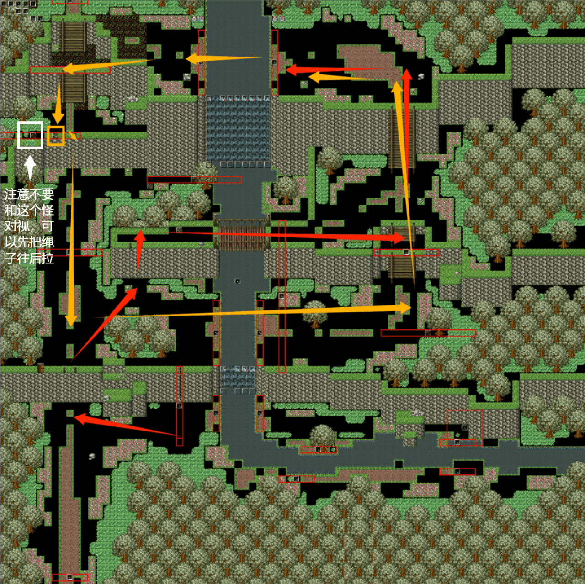

## 进入条件

带上心羽，从体育馆正下方出口（或者南教学楼下方的出后）出去到达操场。（参见[出教学楼剧情](06出教学楼剧情.md)）

往左走，站在操场跑道上，等一会儿，会遇到跑动的铜像。

遇上一次后，触发对话。再遇上一次后，心羽砍爆铜像，爆出混沌。与混沌对话进入美澄支线。

## 分からないところ

直接前进。

## 美澄1

直接前进。

## 美澄2

通过推/拉，可以安放绳梯。

先安好红色的梯子，然后行动到左上角。在绳子处风乃开始独自行动，按照黄色箭头所示移动。

先D键跳过去，沿途安好2个绳梯。然后先不急着汇合，独自来到地图左下角，前往美澄1的另一侧。

来到水边触发事件。之后镜头回到冬璃侧，同样从左下角前往美澄1，找到风乃。获得称号**泥巴癖**

事件后汇合，回到美澄2，沿红色箭头前往下一地图。

出口前的水井：100日元

## ？？？3

解谜。

解谜错误触发**场景19**

## 美澄3

先在红色箭头所指的绳子处，风乃单独行动。

先从右上角找到绳子（黄色方框），安装好绳梯。再按D跳过河，绕到上方安装另一个绳梯（黄色方框）。路上注意不要和标出的两个怪对视。

安装好之后，先不要和冬璃汇合，从右边的河跳过去，按照黄色箭头的线路跳几次后，获得**橡胶挂件033**

（狭窄的地方可以用a后退后再跳跃）

之后返回，与冬璃汇合。

汇合后从梯子沿着红色路线走到上方大河处，触发剧情，风乃跳过河，放下左上方的绳梯。注意不要与左侧的怪对视，可以先把绳子往后拉，然后右拉，最后推到对应位置。

之后沿黄色路线汇合，汇合后一同返回，从刚刚搭的梯子处上去，即可进入下一地图。

## 美澄4

左边的路被怪挡住了，从右边绳子处让风乃单独行动放下绳梯。

上去后会有跟踪怪，注意别被堵死就行。

先把绳子推到底，然后往左拉到梯子口。这时怪应该在上方。往左走到底，再往右走，怪会跟在左边，这时候再往上一格，向右走到梯子上方，往下安装好绳梯。

这时怪会堵在梯子口。汇合后往回走，离开地图，再进入，怪的位置会刷新，这时再一起从刚才放的梯子处上去，走到河上方。

走到河边，风乃会跳过大河。继续前进，跳到左上角。左边有3个堵路的跟踪怪。走到绳子处下去，把怪卡在绳子口。

沿着黄色箭头一路往下，跳过河。中间调查发光处，杀掉拦路的怪。之后通过杀掉的怪的位置往上走，回到河边与冬璃汇合。汇合后再沿着刚才的路线返回，从蓝色箭头的路线前往下一地图。（此时怪被引开，不会挡路）

注意，引开怪后如果死亡或者离开地图，需要重新引怪。

## ？？？4

解谜。

往右侧跳过河，木桩中100日元。

上方有前往[心羽&amp;美澄EX关卡](12心羽&美澄EX.md)的入口（此时不能进入）

通关后，在这里与美澄对话，获得**橡胶挂件076**

## 美澄5

前进，与？？？对话后，掉头回到前一个地图，再进入。剧情后，**隐藏任务**完成。（心羽路线中的隐藏任务如果未完成，这里不会触发。）

## 美澄6

直接前进。

心羽或者雪奈在场时剧情内容会变化。

## ？？？

心羽如果不在场，触发**场景20**并重开。

心羽在场时，剧情后通关。（心羽一个人在分からないところ时，往前走然后过剧情即可）

## Clear后

回到？？？4地图，与美澄对话（瀑布旁边，参见上面的图）获得**橡胶挂件076**

从？？？4地图上方的洞穴中可以通往[心羽&amp;美澄EX关卡](12心羽&美澄EX.md)（带上心羽的情况下）

前往校长室（北边教学楼1F东侧楼梯向左第四个房间）（需要[万能钥匙](04雪奈.md)）

从楼梯往下走，与心羽和美澄对话，搭桥过悬崖。

继续往前，与菲亚和白纱奈对话，消除地上的紫色液体。

继续前进：

