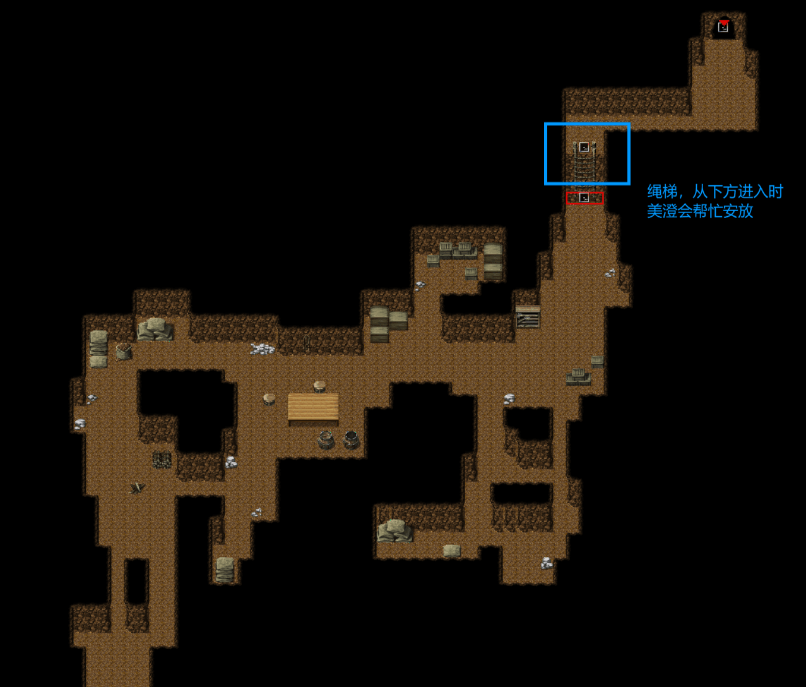
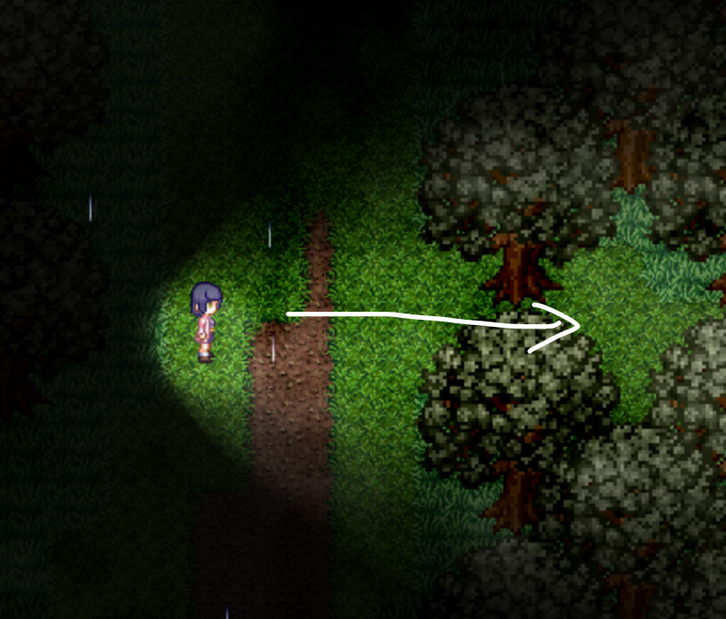
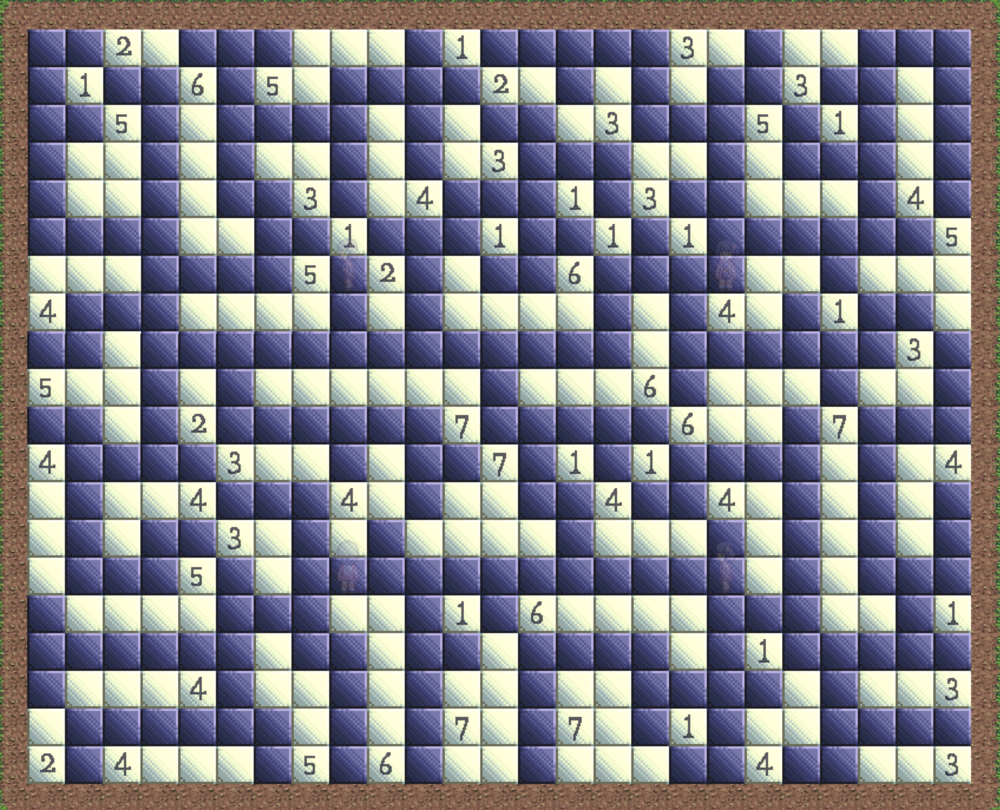

## 进入条件

通关心羽和美澄章节后，带上心羽前往美澄的地图（？？？4），或带上美澄前往心羽的地图（心羽6）。

美澄地图：

入口：见[美澄](11美澄.md)的章节（需要心羽在场才能进入）

通道：通关美澄线后美澄会帮忙放绳梯

心羽地图：

入口：见[心羽](10心羽.md)的章节。心羽6入口附近有条隐藏的岔路（通关心羽线后才能清除沿途的障碍）

通道：用炸药清除障碍，需要美澄在场才能使用

## 谜题

通过通道后进入谜题地图。谜题地图与心羽和美澄的地图都联通(分别在左下角和右下角)，可以从这里去另一个人的地图。第一次反方向通过美澄地图的通道时需要安放绳梯，第一次反方向通过心羽地图时需要拿蓝框中的炸药清除障碍。

往上通往地图ふたりのばしょ，换成心羽视角。进入房间，触摸粉红色光点观看**场景21**

解谜后获得服装**雨衣**，**橡胶挂件087**，触摸混沌观看**场景22**（需要先观看场景21）

给混沌酱3000日元，可以帮忙解开谜题。

