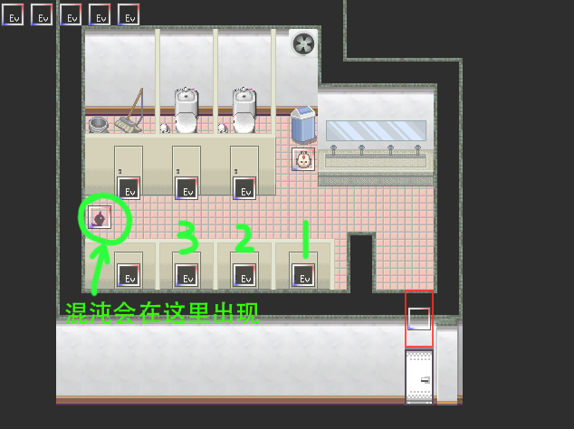
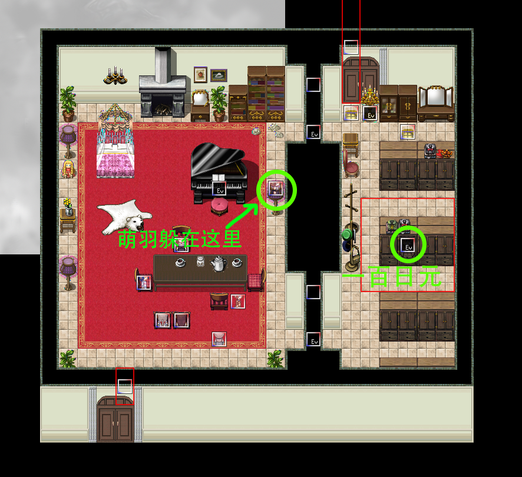
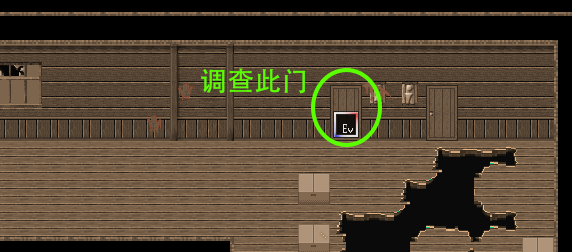
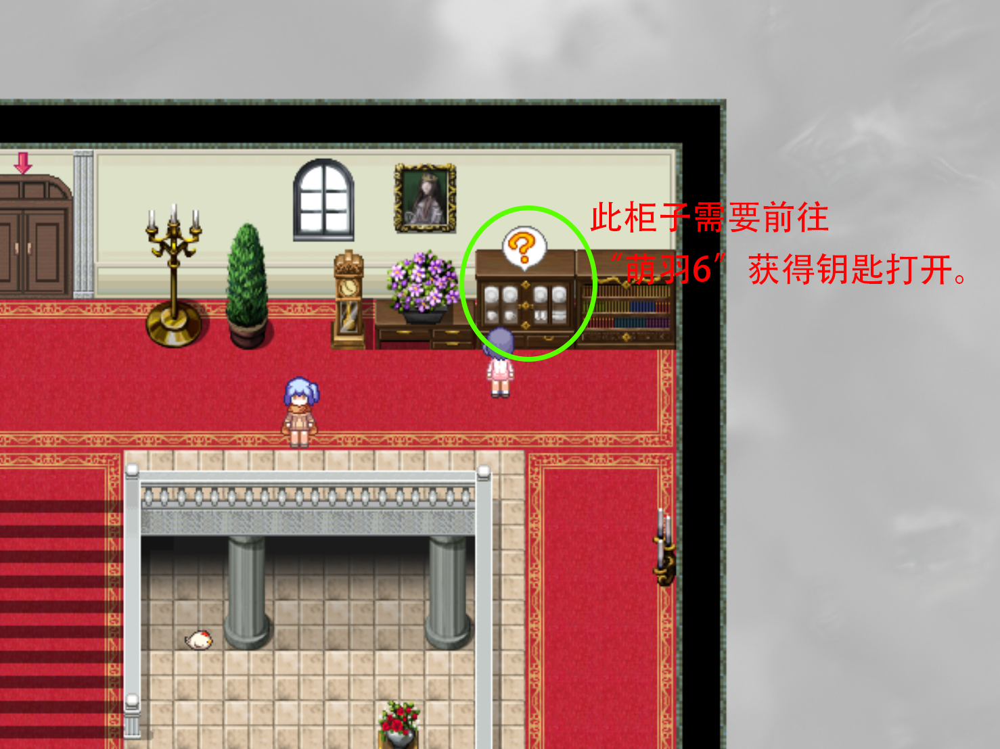
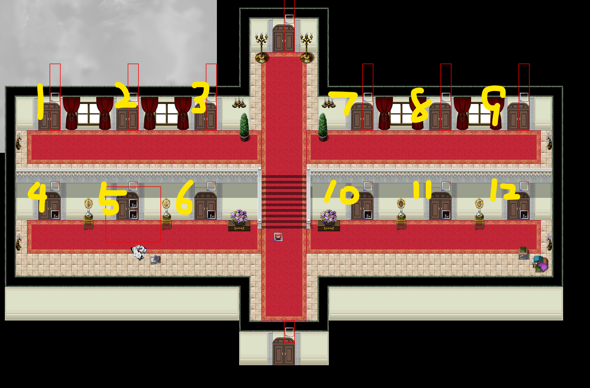
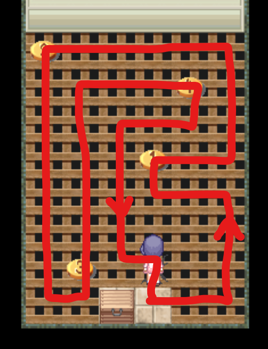
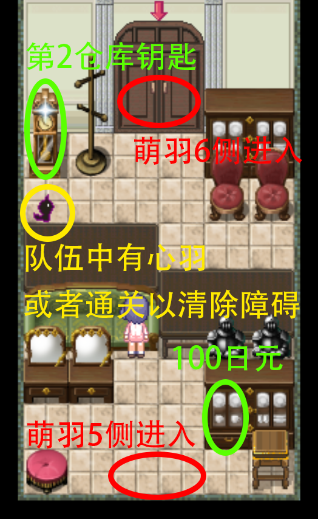
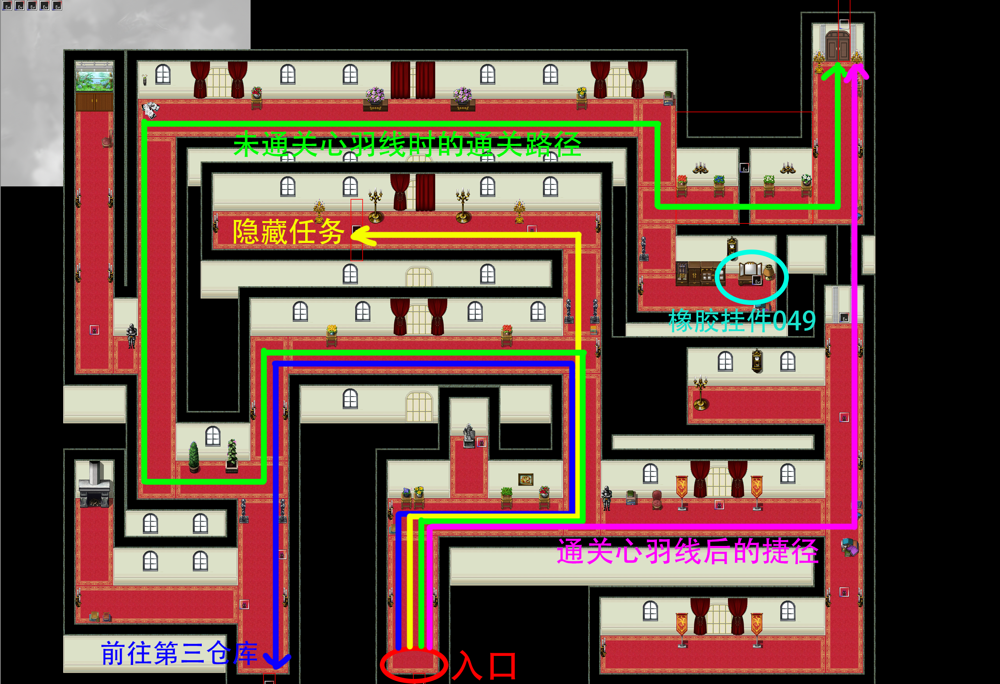
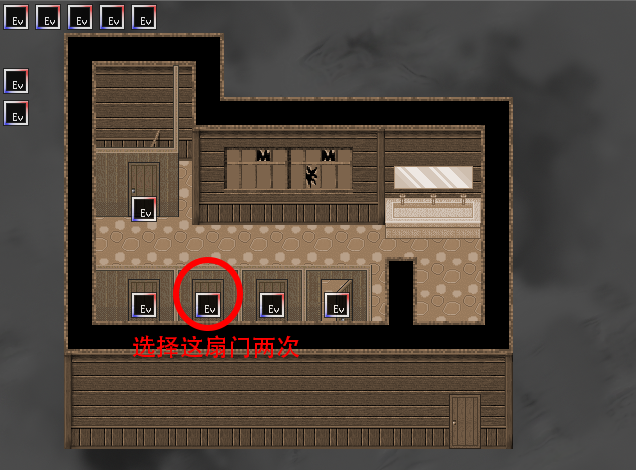

## 进入条件

前往任意一个女厕所，里面有六个厕所隔间以及一个工具间。

调查厕所隔间可以得到三个选项：开门/敲门/呼唤

从调查右下角的一号厕所隔间开始，依次选择敲门、呼唤。

调查左边的二号隔间，依次选择敲门、呼唤。

调查左边的三号隔间，依次选择敲门、呼唤、开门。

触发剧情后，厕所最左边会出现混沌，与其对话即可进入萌羽章节。

如果中途选择错误，可以离开女厕所或者与工具间交互以清除步骤重新开始。

## 分からないところ

直接前进

往回走会回到女厕所。

## 萌羽1

沿路径前进，路上会遇到萌羽并触发剧情。

## 萌羽2

沿路径前进，中途环境会变暗然后再恢复正常。

## ？？？1

解谜。

调查壁炉可以获得100日元。

解谜错误则会触发**场景10**并重新开始。

## 萌羽3

与躲在钢琴旁边植物后面的萌羽对话并触发剧情。（在剧情结束之前无法前进到下一场景。）

剧情结束后于菜单栏选择两次对话，秋穹获得称号**脱衣癖**。

调查右侧房间中间的柜子可以获得100日元。

## 萌羽4

沿路径前进。

中途会触发剧情，改为操控神秘女孩。

沿路径前进调查路径尽头的门结束剧情。

## ？？？2

解谜。

右上角有柜子可以调查，需要使用**某处的钥匙**打开。**某处的钥匙**可以前往“萌羽5”获取。

打开后获得87块**拼图**。

## 萌羽5

在获得钥匙前，调查地图最上面的大门，可以选择使用[发夹](02木柚.md)/[大棒](10心羽.md)/便当打开大门。

不管选择哪个都只会进入一段对话，而门不会打开。

与萌羽对话7次即可获得钥匙。

本地图共有12个仓库，编号如下图。

刚开始仅有3、4、6号仓库可以打开。

##

1号仓库在4号仓库获取**第1仓库的钥匙**后可打开。

该房间每个格子只能走一次，重复行走会落入4号仓库。重新进入该房间地板会恢复原状。

踩完全部四个按钮并返回起点即可调查箱子获得**第7仓库的钥匙**

行走顺序如下图。

##

2号仓库可以在从3号仓库获取**第2仓库的钥匙**后打开。

站在白色方块上即可输入数字。

答案在5号仓库的书架上有提示。

正确答案为8、5、2（上），6、1（中）、7，9（下）。

输入正确后可以调查房间上方的保险箱获得**某处的钥匙**，可以用于打开？？？2与萌羽6的柜子。

##

3号仓库可以从“萌羽5”或者“萌羽6”进入，在刚开始时就可打开。

从“萌羽5”进入可以调查旁边柜子里获得100日元。

从“萌羽6”进入，如果队伍里有心羽或者已经完成了萌羽的故事，则可以清除障碍调查闪光处，获得**第2仓库的钥匙**。

##

4号仓库在刚开始时就可打开。

调查地面的闪光点即可获得**第1仓库的钥匙**。

在1号仓库解谜失败会掉入此房间。

##

5号仓库的门口被障碍物阻挡，可以选择使用文具袋/[发夹](02木柚.md)/[类似撬棍的东西](03千子.md)打开大门。

只有选择[类似撬棍的东西](03千子.md)后才能打开大门。

七个书架对应于2号仓库的七个数字，书架上读物标题的平假名第一个字连起来读即为对应数字。

##

6号仓库在开始时即可打开。

调查右上角打开的柜子，可以获取**第9仓库的钥匙**。

##

7号仓库在一号仓库获得**第7仓库的钥匙**后可以打开。

队伍里有纱夏时调查缝隙可以获得8号仓库内的物品，即**梳妆台的钥匙**。

如果你的队伍里有雪奈或者美澄，会出现特殊对话。

##

8号仓库无法打开，但调查7号仓库的缝隙可以拿到8号房间内的物品。

##

9号仓库需要在6号仓库获得**第9仓库的钥匙**后方可打开。

将右上面的三盏灯拉走打开道路，即可调查发光处获得**第11仓库的钥匙**。

（注意，红色的椅子是可以站上去的）

##

10号仓库需要在12号仓库获得**第10仓库的钥匙**后方可打开。

获得全部拼图后，在队伍里有纱夏的情况下检查墙上的画，即可打开前往[萌羽&纱夏EX](15萌羽&纱夏EX.md)的道路。

##

11号仓库需要在9号仓库获得**第11仓库的钥匙**后方可打开。

里面有一个箱子，打开需要输入密码，提示是“两人的纪念日期”。

密码为1030（10月30日），因为故事开始的事件中提到过“明天是万圣节”。

打开箱子获得**第12仓库的钥匙**。

如果队伍里有纱夏，进入该房间会触发一段剧情，剧情结束后直接获得**第12仓库的钥匙**。

##

12号仓库需要在11号仓库获得**第12仓库的钥匙**后方可打开。

内部的梳妆台需要获得**梳妆台的钥匙**后方可打开，打开后获得**第10仓库的钥匙**。再次调查可获得1块**拼图**。

壁橱上发光的物品在冲刺撞向壁橱后会掉下来，调查后获得63块**拼图**。

## 萌羽6

迷宫，里面有很多四处游荡的混沌，碰到就会重新开始。

地图右侧存在捷径，通关心羽线后调查此处可以破坏墙壁打开捷径。（不需要心羽在队伍里）

地图左侧的通道通向第三仓库的后门，进入后可以来到第三仓库的上半部分。

地图右上部分有梳妆台，使用**某处的钥匙**可以打开，但只能有萌羽故事完成后才能获得**橡胶挂件049**。

地图中央道路上方左拐会发生**隐藏任务**：检查下面位于中央的门两次，可以完成任务并点亮展览室。检查其他门并选择进入，则事件将消失。

具体行走路线见下图。

## ？？？（最深处）

进入后立刻触发事件。

选择“归咎于食材”，会触发**场景11**并重新开始。
选择“归咎于才能”，会重新开始。
选择“归咎于主人”，故事完成。

## 通关后

？？？处调查灶台上发光的物品获得道具**凝固剂**。

？？？处出现两只混沌，对话后选择碰一下可以回看**场景10**和**场景11**。

“萌羽6”内的混沌会全部消失。

使用**某处的钥匙**可以打开“萌羽6”迷宫右上部的梳妆台，获得**橡胶挂件049**。（具体位置参看上文“萌羽6”地图）

调查“萌羽3”中的钢琴，可以触发事件。当队伍里有白纱奈时，会触发另一个事件。

获得全部拼图后，在队伍里有纱夏的情况下检查10号仓库墙上的画，即可打开前往[萌羽&纱夏EX](15萌羽&纱夏EX.md)的道路。

