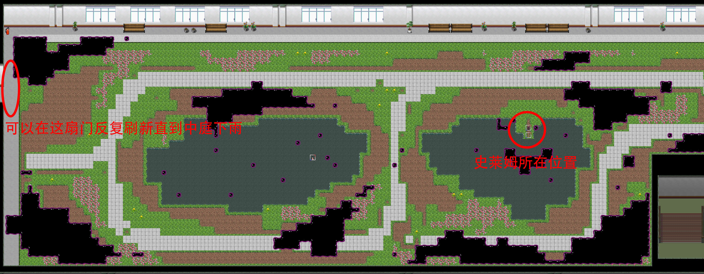
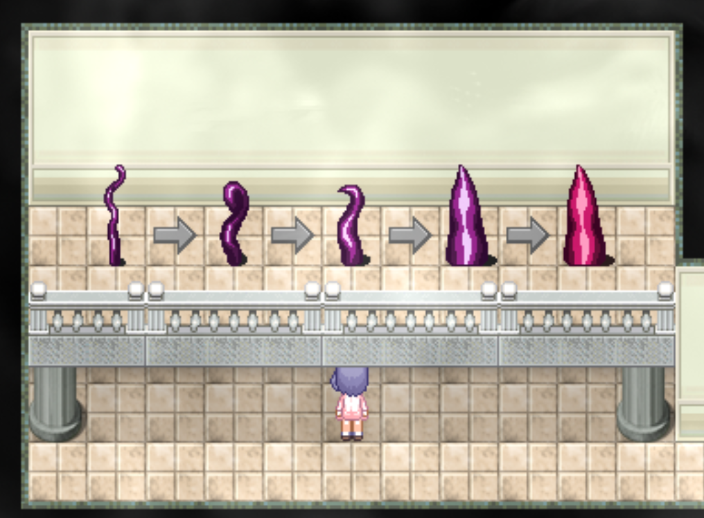
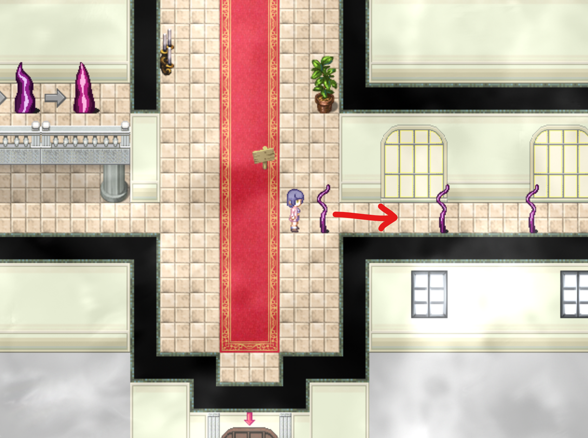
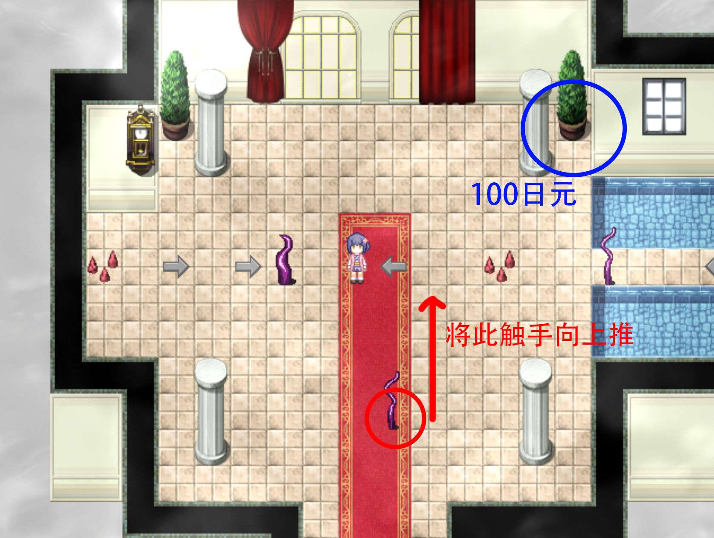
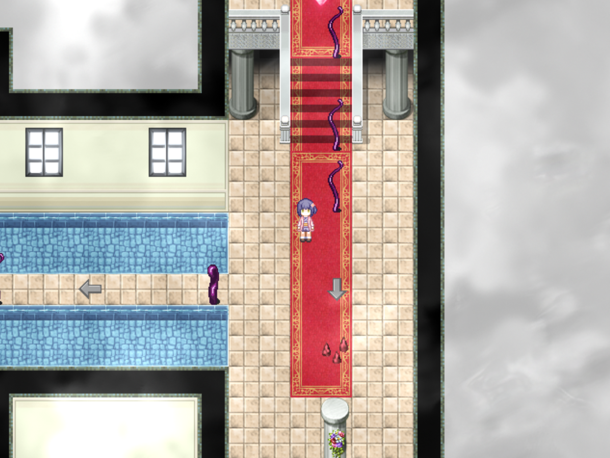
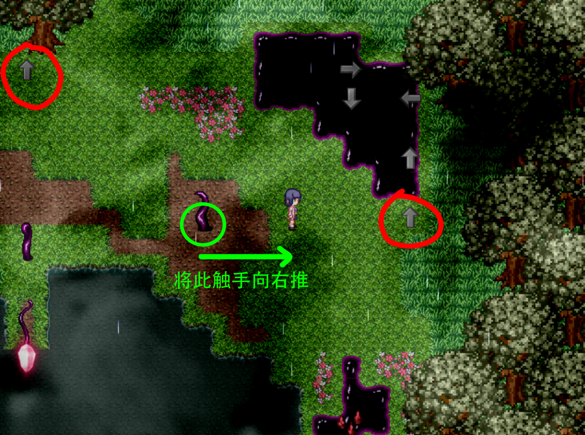
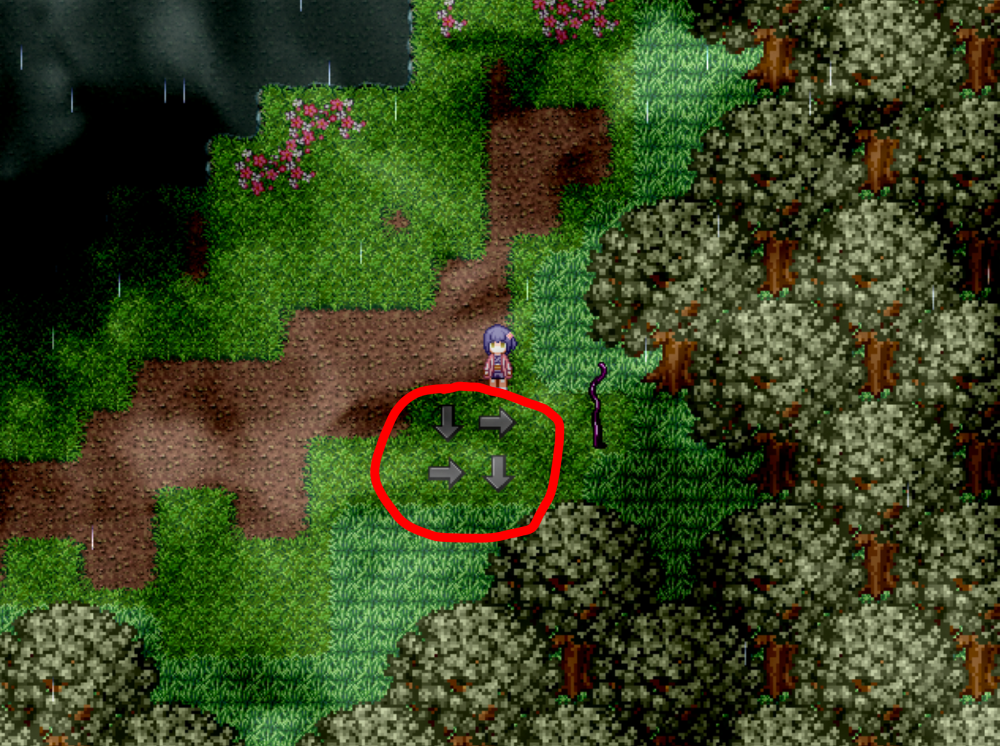

## 进入条件

在下雨的夜晚前往中庭。

每次进入中庭有大约5%的概率下雨，可以重复进出中庭来刷出下雨的场景。

建议从左边的入口刷，因为左边的入口进出过渡动画较短，比较省时间。

在靠右边的池塘岸边有一只混沌史莱姆，调查史莱姆可以选择使用[大棒](10心羽.md)/[类似撬棍的东西](03千子.md)/[凝固剂](13萌羽.md).

只有选择凝固剂可以推进剧情将史莱姆推进池塘，之后在史莱姆所在的池塘岸边站立10秒左右，即可触发剧情进入纱夏章节。

具体位置：

## 分からないところ

直接前进。

往回走会回到中庭。

## 纱夏1

教程：在左边的房间可以看到有关触手等级的教学。

触手从小到大分为五个等级，前四个等级可以推动与移动，遇到其他的触手会发生融合。

融合后触手的等级等于融合前两个触手的等级之和。

当触手等级大于或者等于五时，触手会立刻爆炸。

当触手经过尖刺时，触手的等级会下降一级。

当触手经过箭头时，其运动方向会变为箭头指向的方向，并且箭头会消失。

当触手撞上墙壁后，会向刚才移动的反方向开始移动。

中继核心（红色的宝石）阻挡了道路，将靠近门口的触手向右推即可最终炸毁中继核心。

继续前进。

## 纱夏2

向上走触发教学剧情，混沌会告诉你箭头是可以被推动拉动的。

依然有中继核心阻挡道路，需要炸毁中继核心才能继续前进。

观看触手移动过程演示时长按c键即可提前结束演示环节，并将谜题恢复到演示之前的状态。

调查左侧大厅右上部的盆栽可以获得100日元。

解题方法如下图所示。

继续前进。

## ？？？3

解谜。

与豆豆对话可以获得木柚的称号**大小姐**。

解谜错误则会触发**场景29**并重新开始。

## 纱夏3

沿路径前进。

如果你的队伍里有萌羽，纱夏会出现在途中并触发剧情。此剧情会导致木柚离开队伍。

另外，触发此剧情后分からないところ的地图会变成循环地图，使得玩家在完成纱夏章节之前都无法从分からないところ下方离开。

## 纱夏4（豪宅）

如果你没有触发“纱夏3”的上述剧情，那么会进入此地图。

沿路径前进即可。

## 纱夏4（森林）

如果触发了“纱夏3”的上述剧情，那么会进入此地图。

沿路径前进，期间会听到一声吼叫，同时秋穹离开队伍。

**隐藏任务**：控制场景右边的触手炸掉中继核心。

连接地图左右两边的小河可以跳过。

只有在完成了萌羽章节的隐藏任务之后，此任务对应的展示室灯光才会亮起。

解谜方法如下图所示。

**解法可能不唯一**

中继核心被炸毁后，站在中继核心所在位置触发剧情。

剧情结束后，池塘变得干涸，调查池塘中心的桶获得**橡胶挂件050**。

## ？？？4

解谜。

调查谜题旁的书本可以了解操作说明。

如果秋穹在“纱夏4”中离开了队伍，可以与萌羽交流获得解答提示或者直接解开问题。

如果选择由秋穹直接解开问题，她会直接打开通往下一张地图的门。如果选择由萌羽解开问题，她会将谜题中的空白正确填满。

## 纱夏5

沿路径前进。

调查入口前的裂缝可以获得100日元。

如果秋穹在“纱夏4”中离开了队伍，那么在沿路径前进期间会听到一声吼叫，同时风乃离开队伍。

## 纱夏6

沿路径前进。视野会越来越暗。

## ？？？（最深处）

沿路径向上移动，触发事件。

如果没有触发“纱夏3”的事件（即没带萌羽），会触发**场景31**并重新开始。

如果触发了“纱夏3”的事件，故事完成。

## 通关后

“纱夏4”地图变为豪宅。

“纱夏5”触手消失，调查路上的地板获得100日元。（路过时会有感叹号提示）

“纱夏6”触手消失，并出现一条通往[萌羽&amp;纱夏EX](15萌羽&纱夏EX.md)的道路。但是门需要从另一侧打开一次方可通行。

“？？？（最深处）”地图变为纱夏的房间。

调查床上获得500日元。

有两只混沌，对话后选择碰一下可以回看**场景29**和**场景31**。

根据队伍里是否有萌羽，在此处菜单栏对话的内容也会有所不同。
