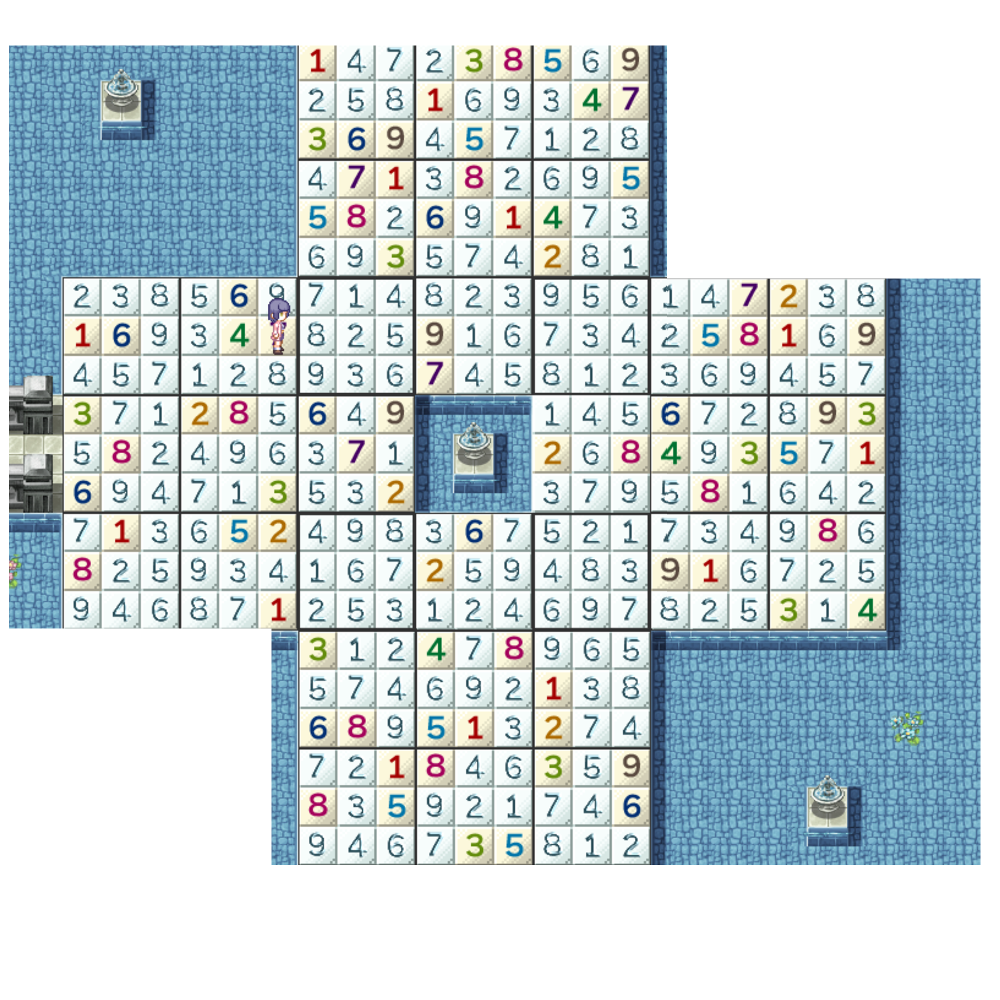

## 进入条件

通关萌羽章节和纱夏章节后，在队伍里有纱夏的前提下来到萌羽的章节。

参照[萌羽章节的攻略](13萌羽.md)打开第10仓库壁炉内通往萌羽&纱夏EX的道路。

## ほのわ·さ一しゃ

按照路径前进。

## ひみつのところ

通过地图下方的走廊可以前往“さーしゃ·ほのわ”，以打开“纱夏6”通往萌羽&纱夏EX的道路。

通过地图右上方的道路可以前往“ふたりのばしょ”。

调查地图左上方房子左边的小路尽头可以获得100日元。

调查地图右下角的卷心菜可以获得500日元。

与豆豆和风乃对话可以获得道具**喵~噜**。

解谜。

调查房子上方右侧的三个书架可以查看操作说明。

水池旁边的按钮踩上去可以重置谜题，此按钮可以拉动推动，可以将其移动到方便的位置。

在谜题上按Q可以标记/取消标记脚下的点，W可以标记十字以及周围八格的点。

按R键可以直接解开脚下一格的答案，但只有一次使用机会。在谜题左上角闪着光的水池可以消耗500日元再次获得一次机会。

谜题答案：

谜题正确解答后会打开谜题右上角的箱子。

与水池旁的混沌酱对话可以消耗3000日元直接打开箱子。

打开箱子获得：

**橡胶挂件092**

服装**女仆装**

一只混沌，与其对话选择触摸可以观看**场景33**。

（必须先前往ふたりのばしょ观看**场景32**后方可观看此场景。）

## さーしゃ·ほのわ

按照路径前进，当队伍里有萌羽时可以清除挡路的史莱姆。

打开路径尽头的门可以解锁“纱夏6”通往萌羽&纱夏EX的道路。

当离开此场景后再次回来时，史莱姆会重新生成。

## ふたりのばしょ

进入房子，调查粉色闪光处，可以观看**场景32**。
