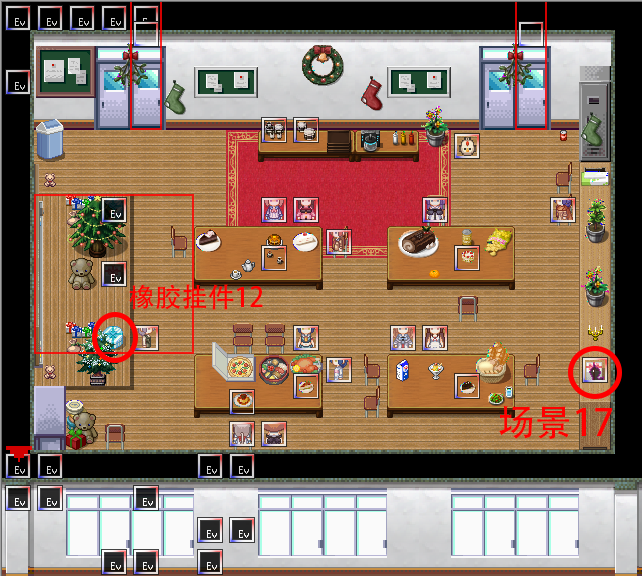

## 进入条件

将系统时间调到12月25日（圣诞节），进入5-2教室触发节日剧情。

按照剧情指引前往6-1教室（三楼从右向左数第三个教室）。

## 6-1教室

进入教室触发剧情，获得**圣诞老人套装**。

房间内的部分人物会换上特殊的圣诞风格立绘。（与在设置-换装中将女主的服装调为**圣诞老人套装**后的效果相同）

与每个人物对话都有特殊剧情。

调查左侧的礼物盒中取得**橡胶挂件12**。

调查右侧的礼物盒，选择“打开看看”会出现一只混沌。（需要在完成所有角色支线后）

在设置-换装中将衣服换为**圣诞老人套装**并与混沌对话，选择“比起这个，先开始主要活动吧”观看**场景17**。

系统时间不为12月25日时离开或进入教室会将地图恢复原状。

